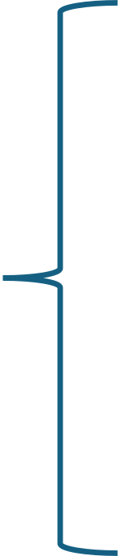

---
format:
  html:
    pagedjs: true
    self-contained: true
    css:
      - styles_editable.css
    toc: false
    number-sections: false
    page-layout: full
    embed-resources: true
    margin: 0
    pagedjs-config:
      bleed: 0
      marks: none
output-file: report_test.html
params:
  pruzkum: "OWy7TRYi"
  benchmarky: "m4MXWOXz"
---

<!---------- Úvodní slide ---------->

<div class="slide intro-slide">
<div class="top-badge"> <span class="pill">Quick Scan</span></div>

<div class="main accent">Engagement průzkum</div>

<div class="subtitle-wrap">
<div class="subtitle">Manažerský výstup</div>
<!-- Reserved empty space for later blurred logo insert -->
<div class="reserved-logo-space" aria-hidden="true"></div>
</div>

<!-- Bottom-left SVG logo (update filename as needed) -->


```{r}
#| echo: false
#| message: false
#| warning: false

#######################setup

instal_funkce <- function(balicek){
  if (!requireNamespace(balicek, quietly = T)){
    install.packages(balicek)
    library(balicek)
  }
  else{
    library(balicek, character.only = T)
  }
}

instal_funkce("here")
instal_funkce("dplyr")
instal_funkce("tidyr")
instal_funkce("readxl")
instal_funkce("extrafont")
instal_funkce("showtext")
instal_funkce("stringr")
instal_funkce("openxlsx")
instal_funkce("ggplot2")
instal_funkce("lubridate")
instal_funkce("purrr")
instal_funkce("httr")
instal_funkce("jsonlite")


font_add("Europa", regular = here("fonts", "EuropaGroNr2JU Regular.otf"),
         bold = here("fonts", "EuropaGroNr2JU Bold.ttf"))
showtext_auto()

token_path <- "token.txt"


##############načtení dat api

if (!file.exists(token_path)) stop("Token file not found.")
tf_token <- trimws(readLines(token_path, warn = FALSE)[1])
if (nchar(tf_token) == 0) stop("Token file is empty.")


tf_get <- function(page,page_size){
  res <- httr::GET(
    "https://api.typeform.com/forms",
    httr::add_headers(Authorization = paste("Bearer", tf_token)),
    query = list(page = page, page_size = page_size)
  )
  httr::stop_for_status(res)
  
  out <- jsonlite::fromJSON(httr::content(res, "text", encoding = "UTF-8"))
  items_df <- out$items
}


forms <- tf_get(1,100)


form <- params$pruzkum


get_form_definition <- function(tf_token, form_id) {
  url <- paste0("https://api.typeform.com/forms/", form_id)
  res <- httr::GET(url, httr::add_headers(Authorization = paste("Bearer", tf_token)))
  httr::stop_for_status(res)
  jsonlite::fromJSON(httr::content(res, "text", encoding = "UTF-8"), simplifyVector = FALSE)
}

def <- get_form_definition(tf_token,form)

get_responses_page <- function(tf_token, form_id, page_size = 1000, before = NULL) {
  base <- paste0("https://api.typeform.com/forms/", form_id, "/responses")
  query <- list(page_size = page_size)
  if (!is.null(before) && nzchar(before)) query$before <- before
  
  res <- httr::GET(
    base,
    httr::add_headers(Authorization = paste("Bearer", tf_token)),
    query = query
  )
  httr::stop_for_status(res)
  jsonlite::fromJSON(httr::content(res, "text", encoding = "UTF-8"), simplifyVector = FALSE)
}


responses <- get_responses_page(tf_token,form)


# Fetch ALL responses by walking "before" tokens (descending submitted_at order)
get_all_responses <- function(tf_token, form_id, page_size = 1000, max_pages = 200) {
  all_items <- list()
  before <- NULL
  
  for (i in seq_len(max_pages)) {
    page <- get_responses_page(tf_token, form_id, page_size = page_size, before = before)
    items <- page$items %||% list()
    
    if (length(items) == 0) break
    all_items <- c(all_items, items)
    
    # Typeform includes a per-response "token" used for before/after traversal
    last_token <- items[[length(items)]]$token %||% ""
    if (!nzchar(last_token)) break
    
    # Next page: older than the last token
    before <- last_token
    
    # If we got less than page_size, we're done
    if (length(items) < page_size) break
  }
  
  all_items
}

all_responses <- get_all_responses(tf_token,form)


#####zpracování datového souboru z průzkumu
#####celkový loop - zpracování odpovědí


odpoved_klasif <- function(o){
  if(o[["field"]][["type"]] == 'multiple_choice'){
    return(as.character(o[["choice"]][["label"]]))
  }
  else if(o[["field"]][["type"]] == 'long_text'){
    return(as.character(o[["text"]]))
  }
  else{
    return(as.character(o[["number"]]))
  }
}


###### 
######tvorba listu + long dataframe

preprocess_data <- function(ls){
  
  processed_list <- list()
  
  ##loop přes respondenty
  for(i in seq_along(ls)){
    
    
    respondent <- ls[[i]]
    
    resp_data <- list(
      respondent_id  = respondent[["response_id"]],
      landed_at    = respondent[["landed_at"]],
      submitted_at = respondent[["submitted_at"]]
    )
    
    respondent_x <- list()
    ###loop přes odpovědi uvnitř respondenta
    for(j in seq_along(respondent[["answers"]])){
      
      odp <- respondent[["answers"]][[j]]
      
      odpoved <- list(
        respondent_id = resp_data$respondent_id,
        landed_at = resp_data$landed_at,
        submitted_at = resp_data$submitted_at,
        typ_otazky = odp[["field"]][["type"]],
        otazka_ref = odp[["field"]][["ref"]],
        odpoved_hodnota = odpoved_klasif(odp)
      )
      
      respondent_x[[j]] <- odpoved
      
    }
    
    processed_list[[i]] <- respondent_x
  }
  
  return(processed_list)
}


survey_data_preprocessed <- preprocess_data(all_responses)


survey_df_long <- dplyr::bind_rows(unlist(survey_data_preprocessed, recursive = FALSE))


#######
######číselník skupin


add_group_title <- function(f){
  if(f[["type"]] == 'group'){
    return(as.character(f[["title"]]))
  }
  else{
    return(NA_character_)
  }
}

add_group_ref <- function(f){
  if(f[["type"]] == 'group'){
    return(as.character(f[["ref"]]))
  }
}


add_q_title <- function(f){
  
  if(f[["type"]] == 'group'){
    return(as.character(f[["ref"]]))
  }
  
}


process_survey_ciselnik <- function(ls){
  
  k <- 1
  
  survey_list <- list()
  
  for(i in seq_along(ls[["fields"]])){
    
    field <- ls[["fields"]][[i]]
    
    if(field[["type"]] == 'group'){
      
      group_data <- list(
        group_title = add_group_title(field),
        group_ref = add_group_ref(field)
      )
      
      
      for(j in seq_along(field[["properties"]][["fields"]])){
        
        ot <- field[["properties"]][["fields"]][[j]]
        
        survey_list[[k]] <- list(
          
          group_title = group_data$group_title,
          group_ref = group_data$group_ref,
          otazka_title = ot[["title"]],
          otazka_ref = ot[["ref"]]
        )
        k <- k+1
      }
    }
    
    else if(field[["type"]] == 'statement') next
    
    else{
      
      survey_list[[k]] <- list(
        group_title = NA_character_,
        group_ref = NA_character_,
        otazka_title = field[["title"]],
        otazka_ref = field[["ref"]]
      )
      
      k <- k+1
    }
    
  }
  return(survey_list)
  
}

ciselnik_list <- process_survey_ciselnik(def)

ciselnik_df <- dplyr::bind_rows(ciselnik_list)

### funkce na standardizování textu

clean_text <- function(x) {
  stringr::str_squish(stringr::str_trim(x))
}


final_long_df <- survey_df_long %>%
  left_join(ciselnik_df, by = "otazka_ref")%>%
  mutate(otazka_title = clean_text(otazka_title))


######### další zpracování - specifické pro engagement survey

multiple_choice_extra <- final_long_df %>% 
  filter(typ_otazky == "multiple_choice") %>%
  summarise(n = n_distinct(otazka_ref))


open <- final_long_df %>%
  filter(typ_otazky == "rating") %>%
  summarise(n = n_distinct(otazka_ref))

###identifikace sekcí helpers

  
include_multiple_choice <- function(df){
  
  multiple_choice_extra <- df %>% 
    filter(typ_otazky == "multiple_choice") %>%
    summarise(n = n_distinct(otazka_ref))
  
  if(multiple_choice_extra$n > 3){
    return(TRUE)
  }
  else{return(FALSE)}
  
}


include_openended <- function(df){
  openend <- df %>%
    filter(typ_otazky == "long_text") %>%
    summarise(n = n_distinct(otazka_ref))
  
  if(openend$n > 0){
    return(TRUE)
  }
  else{
    return(FALSE)
  }
}

include_horsi <- function(df){
  if(any(df$pod_benchmarkem)){
    return(TRUE)
  }
  else{
    return(FALSE)
  }
}

mc_present <- include_multiple_choice(final_long_df)

openend_present <- include_openended(final_long_df)

####zpracování odpovědí

##### demografie

zakl_info <- final_long_df %>%
  filter(group_title == "Základní info" & typ_otazky == "multiple_choice")%>%
  dplyr::select(odpoved_hodnota,otazka_title,respondent_id)

zakl_info_otazky <- unique(zakl_info$otazka_title)

## průměrná doba vyplnění

doba_vyplneni <- final_long_df %>%
  dplyr::select(respondent_id,landed_at,submitted_at)%>%
  group_by(respondent_id) %>%
  mutate(
    landed_at = ymd_hms(landed_at),
    submitted_at = ymd_hms(submitted_at),
    cas_vyplneni = submitted_at - landed_at
  )%>%
  distinct(respondent_id,cas_vyplneni)

avg_doba_vyplneni <- mean(doba_vyplneni$cas_vyplneni)
avg_doba_vyplneni <- round(as.numeric(avg_doba_vyplneni, units = "mins"),0)


#### počet respondentů

pocet_resp <- length(unique(final_long_df$respondent_id))

celkem_zamestnancu <- 5


#### návratnost 

navratnost <- round((pocet_resp/celkem_zamestnancu)*100,2)

## respondenti per oddělení


oddeleni_expr <- "jakém"

oddeleni_index <- str_detect(zakl_info_otazky,oddeleni_expr)

oddeleni_ot <- zakl_info_otazky[oddeleni_index]

oddeleni <- zakl_info %>%
  filter(otazka_title == oddeleni_ot) %>%
  group_by(respondent_id) %>%
  summarise(odpoved_hodnota = first(na.omit(odpoved_hodnota))) %>%
  count(odpoved_hodnota, name = "pocet_respondentu") %>%
  mutate(pocet_zamestnancu = 0)


odd_souhrn_long <- oddeleni %>%
  pivot_longer(cols= 2:3, names_to = "Kategorie", values_to = "Pocet")


odd_souhrn_long$oddeleni_trunc <- str_trunc(odd_souhrn_long$odpoved_hodnota, 
                                            width = 25, ellipsis = "...")


#### věk

vek_souhrn <- final_long_df %>%
  filter(group_title == "Základní info" & typ_otazky == "number") %>%
  dplyr::select(respondent_id,odpoved_hodnota) %>%
  mutate(odpoved_hodnota = as.numeric(odpoved_hodnota))%>%
  group_by(respondent_id)%>%
  summarise(odpoved_hodnota = first(na.omit(odpoved_hodnota)))%>%
  count(odpoved_hodnota,name = "pocet")%>%
  rename(vek = odpoved_hodnota)


#### pozice

pozice_expr <- "jaké\\s"

pozice_index <- str_detect(zakl_info_otazky, pozice_expr)

pozice_ot <- zakl_info_otazky[pozice_index]


pozice_souhrn <- zakl_info %>%
  filter(otazka_title == pozice_ot)%>%
  group_by(respondent_id)%>%
  summarise(odpoved_hodnota = first(na.omit(odpoved_hodnota)))%>%
  count(odpoved_hodnota,name="pocet")%>%
  rename(pozice = odpoved_hodnota)

#### seniorita

doba_expr <- "dlouho"

az_expr <- "\\d+(?=\\-{1})" ### popř. az_expr <- "\\d+(?= až{1})"

do_expr <- "do\\s\\d{1}"

vice_expr <- "více"

doba_index <- str_detect(zakl_info_otazky, doba_expr)

doba_ot <- zakl_info_otazky[doba_index]

doba_souhrn <- zakl_info %>%
  filter(otazka_title == doba_ot)%>%
  group_by(respondent_id)%>%
  summarise(odpoved_hodnota = first(na.omit(odpoved_hodnota)))%>%
  count(odpoved_hodnota,name="pocet")%>%
  mutate(az = case_when(
    str_detect(odpoved_hodnota,do_expr) == T ~ 0,
    str_detect(odpoved_hodnota,vice_expr) == T ~ 100,
    .default = as.integer(str_extract(odpoved_hodnota,az_expr))
  )) %>%
  arrange(az) %>%
  mutate(odpoved_hodnota = factor(odpoved_hodnota, levels = odpoved_hodnota))%>%
  rename(doba=odpoved_hodnota)
#############################################################################

###############engagement
##### engagement index celkem

engagement_index_celkem <- final_long_df %>%
  filter(group_title == "Engagement") %>%
  group_by(respondent_id,odpoved_hodnota)%>%
  summarise(odpoved_hodnota = first(na.omit(odpoved_hodnota)),
            .groups = "drop")%>%
  mutate(odpoved_hodnota = as.numeric(odpoved_hodnota),
         uroven_engagementu = as.factor(case_when(
           odpoved_hodnota < 2 ~ "Úplný engagement",
           odpoved_hodnota >= 2 & odpoved_hodnota <= 3 ~ "Částečný engagement",
           odpoved_hodnota > 3 ~ "Slabý engagement"
         ))
         ) %>%
  ungroup()%>%
  group_by(uroven_engagementu)%>%
  summarise(n = n()) %>%
  mutate(pct = round((n/sum(n))*100,1))

uplny_engagement <- engagement_index_celkem %>%
  filter(uroven_engagementu == "Úplný engagement")%>%
  pull(pct)

castecny_engagement <- engagement_index_celkem %>%
  filter(uroven_engagementu == "Částečný engagement")%>%
  pull(pct)

slaby_engagement <- engagement_index_celkem %>%
  filter(uroven_engagementu == "Slabý engagement")%>%
  pull(pct)

#### engagementové otázky
eng_otazky <- ciselnik_df %>%
  filter(group_title == "Engagement") %>%
  pull(otazka_title)


engagement_index_otazky <- final_long_df %>%
  filter(group_title == "Engagement") %>%
  group_by(respondent_id,odpoved_hodnota,otazka_title)%>%
  summarise(odpoved_hodnota = first(na.omit(odpoved_hodnota)),
            .groups="drop")%>%
  mutate(odpoved_hodnota = as.numeric(odpoved_hodnota),
         uroven_engagementu = as.factor(case_when(
           odpoved_hodnota < 2 ~ "Úplný engagement",
           odpoved_hodnota >= 2 & odpoved_hodnota <= 3 ~ "Částečný engagement",
           odpoved_hodnota > 3 ~ "Slabý engagement"
         ))) %>%
  ungroup()%>%
  group_by(uroven_engagementu,otazka_title) %>%
  summarise(n = n()) %>%
  group_by(otazka_title) %>%
  mutate(pct = round((n/sum(n))*100,1),
         otazka_title = factor(otazka_title, levels = rev(eng_otazky))) %>%
  ungroup()

### pořadí hodnot
eng_order <- c("Úplný engagement","Částečný engagement","Slabý engagement")

engagement_index_otazky$uroven_engagementu <- factor(engagement_index_otazky$uroven_engagementu,
                            levels = rev(eng_order))

###### engagement index podle oddělení

odd_responses <- final_long_df %>%
  filter(otazka_title == oddeleni_ot)%>%
  dplyr::select(respondent_id,odpoved_hodnota)%>%
  group_by(respondent_id)%>%
  summarise(odpoved_hodnota = first(na.omit(odpoved_hodnota)))%>%
  rename(oddeleni = odpoved_hodnota)


eng_index_odd <- final_long_df %>%
  filter(group_title == "Engagement") %>%
  group_by(respondent_id,odpoved_hodnota)%>%
  summarise(odpoved_hodnota = first(na.omit(odpoved_hodnota)),
            .groups = "drop")%>%
  mutate(odpoved_hodnota = as.numeric(odpoved_hodnota),
         uroven_engagementu = as.factor(case_when(
           odpoved_hodnota < 2 ~ "Úplný engagement",
           odpoved_hodnota >= 2 & odpoved_hodnota <= 3 ~ "Částečný engagement",
           odpoved_hodnota > 3 ~ "Slabý engagement"
         ))) %>%
  left_join(odd_responses,by = "respondent_id")%>%
  ungroup()%>%
  group_by(oddeleni,uroven_engagementu) %>%
  count(uroven_engagementu, name="n") %>%
  group_by(oddeleni)%>%
  mutate(pct = round((n/sum(n))*100,1)) %>%
  ungroup()

eng_index_odd$uroven_engagementu <- factor(eng_index_odd$uroven_engagementu,
                            levels = rev(eng_order))

split_depts <- function(df){
  
  odd <- unique(df$oddeleni)
  nr_dept <- length(odd)
  ratio <- nr_dept/10
  mod <- nr_dept%%10
  df_list <- list()
  
  
  if(mod==0){
    nr_slides <- ratio
    iterable <- seq(1,nr_slides,1)
    
    for(i in iterable){
      ind <- i*10
      odd_i <- na.omit(odd[(ind-9):ind])
      d <- df%>%filter(oddeleni %in% odd_i)
      
      df_list[[i]] <- d
    }
  }
  else{
    nr_slides <- ratio+1
    iterable <- seq(1,nr_slides,1)
    
    for(i in iterable){
      ind <- i*10
      odd_i <- na.omit(odd[(ind-9):ind])
      d <- df%>%filter(oddeleni %in% odd_i)
      
      df_list[[i]] <- d
    }
  }
  return(df_list)
}

eng_odd_list <- split_depts(eng_index_odd)

eng_odd_pages <- length(eng_odd_list)

render_eng_odd_slides <- function(df_list, total_pages) {
  if (length(df_list) == 0) {
    return(invisible(NULL))
  }

  slide_template <- paste(
    '<div class="slide eio-v2">',
    '<div class="eio-header">',
    '<p class="eio-kicker">Vysledky</p>',
    '<h1 class="eio-title">Srovnani <span class="accent-teal">engagementu indexu</span> napric oddelenimi</h1>',
    '</div>',
    '<div class="eio-chart">',
    '```{r}',
    '#| echo: false',
    '#| warning: false',
    '#| message: false',
    '#| fig-width: 13.4',
    '#| fig-height: 7.5',
    '#| fig-align: center',
    '',
    'df_page <- df_list[[{{i}}]]',
    '',
    'ggplot(df_page, aes(x = oddeleni, y = pct, fill = uroven_engagementu)) +',
    '  geom_col(position = position_stack(), width = 0.62) +',
    '  geom_text(',
    '    aes(label = paste0(pct, "%")),',
    '    position = position_stack(vjust = 0.5),',
    '    family = "Europa",',
    '    fontface = "bold",',
    '    size = 6.2',
    '  ) +',
    '  scale_fill_manual(values = colors_eng) +',
    '  theme_minimal(base_family = "Europa") +',
    '  theme(',
    '    panel.grid = element_blank(),',
    '    panel.background = element_rect(fill = "transparent", colour = NA),',
    '    plot.background = element_rect(fill = "transparent", colour = NA),',
    '    axis.text.x = element_text(family = "Europa", face = "bold", size = 20, angle = 45),',
    '    axis.text.y = element_blank(),',
    '    axis.ticks = element_blank(),',
    '    axis.title.x = element_blank(),',
    '    axis.title.y = element_blank(),',
    '    legend.position = "none",',
    '    plot.margin = margin(t = 10, r = 86, b = 0, l = 10)',
    '  )',
    '```',
    '</div>',
    '{{arrow_html}}',
    '<div class="eio-legend"><div class="eio-legend-label">Skala odpovedi</div><div class="eio-legend-items"><div class="eio-legend-item"><i class="eio-swatch teal"></i>Fully engaged</div><div class="eio-legend-item"><i class="eio-swatch grey"></i>Partially engaged</div><div class="eio-legend-item"><i class="eio-swatch pink"></i>Disengaged</div></div></div>',
    '</div>',
    sep = "\n"
  )

  rendered_slides <- lapply(seq_along(df_list), function(i) {
    arrow_html <- if (i < total_pages) {
      '<div class="eio-next">&gt;&gt;</div>'
    } else {
      ""
    }

    expanded_slide <- knitr::knit_expand(
      text = slide_template,
      i = i,
      arrow_html = arrow_html
    )

    knitr::knit_child(text = expanded_slide, quiet = TRUE, envir = environment())
  })

  cat(unlist(rendered_slides), sep = "\n")
}

##### individuální míra engagementu
ind_engagement <- final_long_df %>%
  filter(group_title == "Engagement") %>%
  group_by(respondent_id,odpoved_hodnota) %>%
  summarise(odpoved_hodnota = first(na.omit(odpoved_hodnota)),
            .groups="drop")%>%
  group_by(respondent_id)%>%
  mutate(
    odpoved_hodnota = as.numeric(odpoved_hodnota),
    prum_eng = mean(odpoved_hodnota),
    ind_mira = case_when(
      prum_eng <= 1.2 ~ "Engaged",
      prum_eng > 1.2 & prum_eng <= 2.5 ~ "Potential",
      prum_eng > 2.5 ~ "Disengaged"
    )) %>%
  ungroup()%>%
  distinct(respondent_id,ind_mira) %>%
  group_by(ind_mira) %>%
  summarise(n = n()) %>%
  mutate(pct = round((n/sum(n))*100,1))

engaged <- ind_engagement%>%filter(ind_mira == "Engaged")%>%pull(pct)
engaged <- ifelse(length(engaged)>0,engaged,0)
potential <- ind_engagement%>%filter(ind_mira == "Potential")%>%pull(pct)
potential <- ifelse(length(potential)>0,potential,0)
disengaged <- ind_engagement%>%filter(ind_mira == "Disengaged")%>%pull(pct)
disengaged <- ifelse(length(disengaged)>0,disengaged,0)


##### individuální míra engagementu po odděleních

ind_eng_odd <- final_long_df %>%
  filter(group_title == "Engagement") %>%
  group_by(respondent_id,odpoved_hodnota) %>%
  summarise(odpoved_hodnota = first(na.omit(odpoved_hodnota)))%>%
  group_by(respondent_id)%>%
  mutate(
    odpoved_hodnota = as.numeric(odpoved_hodnota),
    prum_eng = mean(odpoved_hodnota),
    ind_mira = case_when(
      prum_eng <= 1.2 ~ "Engaged",
      prum_eng > 1.2 & prum_eng <= 2.5 ~ "Potential",
      prum_eng > 2.5 ~ "Disengaged"
    )) %>%
  left_join(odd_responses,by="respondent_id")%>%
  ungroup() %>%
  distinct(respondent_id,ind_mira,oddeleni)%>%
  group_by(oddeleni,ind_mira) %>%
  count(ind_mira,name="n") %>%
  group_by(oddeleni)%>%
  mutate(pct = round((n/sum(n))*100,1))

ind_odd_list <- split_depts(ind_eng_odd)

ind_odd_pages = length(ind_odd_list)

render_ind_odd_slides <- function(df_list, total_pages) {
  if (length(df_list) == 0) {
    return(invisible(NULL))
  }

  slide_template <- paste(
    '<div class="slide eio-v2">',
    '<div class="eio-header">',
    '<p class="eio-kicker">Vysledky</p>',
    '<h1 class="eio-title">Srovnani <span class="accent-teal">individualni miry engagementu</span> napric oddelenimi</h1>',
    '</div>',
    '<div class="eio-chart">',
    '```{r}',
    '#| echo: false',
    '#| warning: false',
    '#| message: false',
    '#| fig-width: 13.4',
    '#| fig-height: 7.5',
    '#| fig-align: center',
    '',
    'df_page <- df_list[[{{i}}]]',
    '',
    'ggplot(df_page, aes(x = oddeleni, y = pct, fill = ind_mira)) +',
    '  geom_col(position = position_stack(), width = 0.62) +',
    '  geom_text(',
    '    aes(label = paste0(pct, "%")),',
    '    position = position_stack(vjust = 0.5),',
    '    family = "Europa",',
    '    fontface = "bold",',
    '    size = 6.2',
    '  ) +',
    '  scale_fill_manual(values = colors_ind_mira) +',
    '  theme_minimal(base_family = "Europa") +',
    '  theme(',
    '    panel.grid = element_blank(),',
    '    panel.background = element_rect(fill = "transparent", colour = NA),',
    '    plot.background = element_rect(fill = "transparent", colour = NA),',
    '    axis.text.x = element_text(family = "Europa", face = "bold", size = 20, angle = 45),',
    '    axis.text.y = element_blank(),',
    '    axis.ticks = element_blank(),',
    '    axis.title.x = element_blank(),',
    '    axis.title.y = element_blank(),',
    '    legend.position = "none",',
    '    plot.margin = margin(t = 10, r = 86, b = 0, l = 10)',
    '  )',
    '```',
    '</div>',
    '{{arrow_html}}',
    '<div class="eio-legend"><div class="eio-legend-label">Skala odpovedi</div><div class="eio-legend-items"><div class="eio-legend-item"><i class="eio-swatch teal"></i>Fully engaged</div><div class="eio-legend-item"><i class="eio-swatch grey"></i>Partially engaged</div><div class="eio-legend-item"><i class="eio-swatch pink"></i>Disengaged</div></div></div>',
    '</div>',
    sep = "\n"
  )

  rendered_slides <- lapply(seq_along(df_list), function(i) {
    arrow_html <- if (i < total_pages) {
      '<div class="eio-next">&gt;&gt;</div>'
    } else {
      ""
    }

    expanded_slide <- knitr::knit_expand(
      text = slide_template,
      i = i,
      arrow_html = arrow_html
    )

    knitr::knit_child(text = expanded_slide, quiet = TRUE, envir = environment())
  })

  cat(unlist(rendered_slides), sep = "\n")
}

###############################################################################
############# drivery 

drivery_overview <- final_long_df %>%
  filter(group_title != "Základní info" & group_title != "Engagement"
         & typ_otazky == "opinion_scale") %>%
  mutate(odpoved_kat = case_when(
    odpoved_hodnota <= 2 ~ "Skvělý výsledek",
    odpoved_hodnota == 3 ~ "Průměrný výsledek",
    odpoved_hodnota > 3 ~ "Špatný výsledek"
  ))%>%
  group_by(group_title, odpoved_kat) %>%
  summarise(n = n()) %>%
  group_by(group_title) %>%
  mutate(pct = round((n/sum(n))*100,1))


drivery_sort <- drivery_overview %>%
  filter(odpoved_kat == "Skvělý výsledek") %>%
  arrange(desc(pct)) %>%
  ungroup() %>%
  mutate(poradi = row_number())

drivery_overview_complete <- drivery_overview %>%
  left_join(drivery_sort %>% select(group_title,poradi), by = "group_title") %>%
  arrange(poradi)


drivery_otazky <- final_long_df %>%
  filter(group_title != "Základní info" & group_title != "Engagement"
         & typ_otazky == "opinion_scale") %>%
  mutate(odpoved_kat = case_when(
    odpoved_hodnota <= 2 ~ "Skvělý výsledek",
    odpoved_hodnota == 3 ~ "Průměrný výsledek",
    odpoved_hodnota > 3 ~ "Špatný výsledek"
  ))%>%
  group_by(group_title,otazka_title,odpoved_kat)%>%
  summarise(n = n())%>%
  group_by(otazka_title)%>%
  mutate(pct = round((n/sum(n))*100,2))%>%
  left_join(drivery_sort%>%select(group_title,poradi), by = "group_title")


get_driver_results <- function(data,place){
  data %>%
    filter(poradi == place)
}

get_question_results <- function(data,place){
  data %>%
    filter(poradi==place)
}


driver_split <- split(drivery_overview_complete, drivery_overview_complete$poradi)
question_split <- split(drivery_otazky, drivery_otazky$poradi)

driver_list <- Map(function(driver,question){
  list(
    driver_result = driver,
    question_result = question
  )
},driver_split,question_split)


####### porovnání s benchmarky

##### načtení benchmarků

bench_form <- params$benchmarky

bench_def <- get_form_definition(tf_token,bench_form)

bench_responses <- get_responses_page(tf_token,bench_form)

bench_all_responses <- get_all_responses(tf_token,bench_form)

bench_data_preprocessed <- preprocess_data(bench_all_responses)

bench_df_long <- dplyr::bind_rows(unlist(bench_data_preprocessed, recursive = FALSE))

bench_ciselnik_list <- process_survey_ciselnik(bench_def)

bench_ciselnik_df <- dplyr::bind_rows(bench_ciselnik_list)


bench_df_complete <- bench_df_long %>%
  left_join(bench_ciselnik_df, by = "otazka_ref")%>%
  mutate(odpoved_hodnota = as.numeric(odpoved_hodnota),
         otazka_title = clean_text(otazka_title))


###### jednotlivé benchmarky engagementu

bench_cr_val <- bench_df_complete %>% filter(otazka_title=="Česká republika")%>%
  pull(odpoved_hodnota)

bench_cr_name <- bench_df_complete %>% filter(otazka_title=="Česká republika")%>%
  pull(otazka_title)


bench_us_val <- bench_df_complete %>% filter(otazka_title=="USA")%>%
  pull(odpoved_hodnota)

bench_us_name <- bench_df_complete %>% filter(otazka_title=="USA")%>%
  pull(otazka_title)

bench_ger_val <- bench_df_complete %>% filter(otazka_title=="Německo")%>%
  pull(odpoved_hodnota)

bench_ger_name <- bench_df_complete %>% filter(otazka_title=="Německo")%>%
  pull(otazka_title)

### aktuální výsledky vs benchmarky

#drivery_clean <- drivery_otazky %>%
#  mutate(otazka_title = str_squish(str_trim(otazka_title)))

#bench_clean <- bench_df_complete %>%
#  mutate(otazka_title = str_squish(str_trim(otazka_title)))

drivery_benchmark <- drivery_otazky %>%
  dplyr::select(otazka_title,odpoved_kat,pct)%>%
  left_join(
    bench_df_complete %>% select(otazka_title,odpoved_hodnota),
    by = "otazka_title"
  ) %>%
  filter(odpoved_kat == "Skvělý výsledek")%>%
  mutate(pod_benchmarkem = case_when(
    odpoved_hodnota == NA ~ NA,
    pct < odpoved_hodnota ~ TRUE,
    pct >= odpoved_hodnota ~ FALSE
  ))


include_horsi <- function(df){
  if(any(df$pod_benchmarkem, na.rm = T)){
    return(TRUE)
  }
  else{
    return(FALSE)
  }
}

horsi_vysledky_present <- include_horsi(drivery_benchmark)

driver_benchmark_columns <- c("Firma", "Česká republika", "USA", "Německo")

build_driver_benchmark_placeholder_table <- function(driver_results, column_config) {
  base_table <- driver_results %>%
    filter(odpoved_kat == "Skvělý výsledek") %>%
    distinct(group_title, pct, poradi) %>%
    arrange(poradi) %>%
    transmute(
      driver_name = group_title,
      Firma = round(pct)
    )

  benchmark_columns <- setdiff(column_config, "Firma")

  for (col_name in benchmark_columns) {
    base_table[[col_name]] <- pmax(
      35,
      pmin(
        95,
        round(base_table$Firma + ((seq_len(nrow(base_table)) %% 4) - 1.5) * 4 - 3)
      )
    )
  }

  base_table
}

render_driver_benchmark_results <- function(table_df, column_config) {
  if (nrow(table_df) == 0) {
    return(invisible(NULL))
  }

  visible_columns <- intersect(column_config, names(table_df))
  value_columns <- setdiff(visible_columns, "driver_name")

  header_html <- paste0(
    '<div class="dbr-row dbr-row-head">',
    '<div></div>',
    paste(
      vapply(value_columns, function(col_name) {
        paste0(
          '<div class="dbr-head-cell',
          if (identical(col_name, "Firma")) ' accent' else '',
          '"><span class="angled">', htmltools::htmlEscape(col_name), '</span></div>'
        )
      }, character(1)),
      collapse = ""
    ),
    '</div>'
  )

  body_html <- paste(
    vapply(seq_len(nrow(table_df)), function(i) {
      row_df <- table_df[i, , drop = FALSE]
      paste0(
        '<div class="dbr-row">',
        '<div class="dbr-label">', htmltools::htmlEscape(row_df$driver_name[[1]]), '</div>',
        paste(
          vapply(value_columns, function(col_name) {
            value <- row_df[[col_name]][[1]]
            paste0(
              '<div class="dbr-cell',
              if (identical(col_name, "Firma")) ' accent' else '',
              '">',
              htmltools::htmlEscape(paste0(value, ' %')),
              '</div>'
            )
          }, character(1)),
          collapse = ""
        ),
        '</div>'
      )
    }, character(1)),
    collapse = "\n"
  )

  slide_html <- paste0(
    '<div class="slide driver-bench-results-v2">',
    '<div class="dbr-kicker">Vysledky</div>',
    '<div class="dbr-title">Srovnani <span class="accent-teal">driveru</span> s relevantnimi benchmarky</div>',
    '<div class="dbr-table" style="--dbr-col-count:', length(value_columns), ';">',
    header_html,
    body_html,
    '</div>',
    '</div>'
  )

  cat(slide_html)
}

driver_benchmark_results_table <- build_driver_benchmark_placeholder_table(
  drivery_overview_complete,
  driver_benchmark_columns
)


```

</div>


<!----- Co nas ceka ---------->

```{r}
#| echo: false
#| warning: false
#| message: false

progress_rectangles <- function(filled_rectangles, total_rectangles) {
  total_rectangles <- as.integer(total_rectangles)
  filled_rectangles <- as.integer(filled_rectangles)

  rectangles <- rep('<span class="ghost"></span>', total_rectangles)

  if (filled_rectangles > 0) {
    rectangles[seq_len(min(filled_rectangles, total_rectangles))] <- '<span class="on"></span>'
  }

  paste(rectangles, collapse = "\n")
}

agenda_progress_total <- 8
agenda_progress_filled <- 0
section01_progress_total <- 8
section01_progress_filled <- 1
section02_progress_total <- 8
section02_progress_filled <- 2
section03_progress_total <- 8
section03_progress_filled <- 3
problematic_progress_total <- 8
problematic_progress_filled <- 4
multiple_choice_progress_total <- 8
multiple_choice_progress_filled <- 5
```


<!----------- Co nás dnes čeká --------------------------------------->

```{r}
#| echo: false
#| warning: false
#| message: false

library(stringr)

# Example input booleans
# mc_present <- TRUE
# openend_present <- TRUE
# horsi_vysledky_present <- FALSE

agenda_vector <- c(horsi_vysledky_present, mc_present, openend_present)

build_agenda <- function(x) {
  
  base_sections <- c(
    "Průzkum v číslech",
    "Výsledky engagementu",
    "Výsledky jednotlivých driverů"
  )
  
  optional_sections <- c()
  
  if (x[1]) {
    optional_sections <- c(optional_sections, "Otázky, které dopadly hůře")
  }
  
  if (x[2]) {
    optional_sections <- c(optional_sections, "Multiple choice otázky")
  }
  
  if (x[3]) {
    optional_sections <- c(optional_sections, "Otevřené otázky")
  }
  
  final_section <- "Závěrečná shrnutí a doporučení"
  
  sections <- c(base_sections, optional_sections, final_section)
  
  list(
    sections = sections,
    total_sections = length(sections),
    progress_total = length(sections) + 1
  )
}

make_agenda_items <- function(sections) {
  items <- character(length(sections))
  
  for (i in seq_along(sections)) {
    items[i] <- sprintf(
      paste0(
        '<li class="agenda-item">',
        '<span class="agenda-num">%02d</span>',
        '<span class="agenda-text">%s</span>',
        '</li>'
      ),
      i,
      sections[i]
    )
  }
  
  paste(items, collapse = "\n")
}

progress_rectangles <- function(filled_rectangles, total_rectangles) {
  total_rectangles <- as.integer(total_rectangles)
  filled_rectangles <- as.integer(filled_rectangles)

  rectangles <- rep('<span class="ghost"></span>', total_rectangles)

  if (filled_rectangles > 0) {
    rectangles[seq_len(min(filled_rectangles, total_rectangles))] <- '<span class="on"></span>'
  }

  paste(rectangles, collapse = "\n")
}

agenda_cfg <- build_agenda(agenda_vector)

agenda_progress_total <- agenda_cfg$progress_total
agenda_progress_filled <- 0

get_progress <- function(agenda_cfg, section_name) {
  pos <- match(section_name, agenda_cfg$sections)
  list(
    filled = pos,
    total = agenda_cfg$progress_total
  )
}
```

<div class="slide agenda-slide"> 
<div class="agenda-content"> 
<div class="agenda-title">Co nás dnes čeká</div> 
<ul class="agenda-list">

```{r} 
#| echo: false 
#| results: asis

cat(make_agenda_items(agenda_cfg$sections))
```
</ul>

<div class="scv-progress">
```{r}
#| echo: false
#| results: asis

cat(progress_rectangles(agenda_progress_filled, agenda_progress_total))
```
</div>

</div>
</div>


<!---- Průzkum v číslech sekce ----->

<div class="slide section-slide">

<div class="section-number">01</div>

<div class="section-title">Průzkum v číslech</div>

<div class="section-description">
Tato sekce poskytuje základní přehled o průběhu průzkumu ve firmě.
Ukážeme Vám např. kolik zaměstnanců se průzkumu zúčastnilo celkově,
za jednotlivé organizační jednotky nebo podle demografických údajů.
</div>

<div class="scv-progress">
```{r}
#| echo: false
#| results: asis

pvc_progress <- get_progress(agenda_cfg, "Průzkum v číslech")

cat(progress_rectangles(pvc_progress$filled, pvc_progress$total))
```
</div>

</div>


<!-------- Průzkum v číslech výsledky --------------->

<div class="slide survey-numbers-slide">

<div class="survey-title">Průzkum v číslech</div>

<!-- Základní info -->
<div class="survey-kpis">

<div class="survey-kpi-block">

<div>
<span class="survey-kpi-number">`r navratnost`</span>
<span class="survey-kpi-unit">%</span>
</div>
<div class="survey-kpi-text">
je číslo, které odpovídá celkové návratnosti odpovědí od vašich zaměstnanců.
</div>
</div>


<div class="survey-kpi-block">
<div>
<span class="survey-kpi-number">`r avg_doba_vyplneni`</span>
<span class="survey-kpi-unit">minut</span>
</div>
<div class="survey-kpi-text">
trvalo průměrně vyplnění dotazníku.
</div>
</div>


<div class="survey-kpi-block">
<div>
<span class="survey-kpi-number">`r pocet_resp`</span>
<span class="survey-kpi-unit">lidí</span>
</div>
<div class="survey-kpi-text">
ve vaší firmě odpovědělo na průzkum.
</div>
</div>

</div>

<!-- Prostřední grafy -->

<div class="survey-main">
<div>
<div class="survey-box">
<div class="survey-box-title">Respondenti podle oddělení</div>
```{r}
#| echo: false
#| warning: false
#| message: false
#| fig-height: 4
#| fig-align: center

ggplot(odd_souhrn_long,aes(x = oddeleni_trunc, y = Pocet, fill = Kategorie))+
  geom_col(width = .8, position = "dodge")+
  geom_text(aes(label = Pocet), 
            position = position_dodge(width = .8),
            family = "Europa",
            fontface = "bold", size = 6,
            vjust = -.3)+
  scale_y_continuous(expand = expansion(mult = c(0,.1)))+
  theme(
    axis.title.x = element_blank(),
    axis.title.y = element_blank(),
    axis.ticks.y = element_blank(),
    axis.text.y = element_blank(),
    axis.text.x = element_text(
      family = "Europa", face = "plain", size = 20, angle = 30, 
      vjust = .5),
    legend.position = "bottom",
    legend.title = element_blank(),
    panel.background = element_blank(),
    legend.text = element_text(
      family = "Europa", face = "plain", size = 20
    )
  )+
  scale_fill_manual(values = c("pocet_respondentu" = "#63E8C6","pocet_zamestnancu" = "#D1D1D1"),
                    labels = c("Počet respondentů", "Počet zaměstnanců"))
```
</div>
</div>

<div>
<div class="survey-box">
<div class="survey-box-title">Respondenti podle věku</div>
```{r}
#| echo: false
#| warning: false
#| message: false
#| fig-height: 2
#| fig-align: center

ggplot(vek_souhrn, aes(x = vek, y = pocet))+
  geom_col(fill = "#63E8C6", width = .9, position = "dodge")+
  geom_text(aes(label = pocet), 
            family = "Europa", fontface = "bold", 
            size = 6, vjust = -.3)+
  scale_y_continuous(expand = expansion(mult = c(0,.1)))+
  theme(
    panel.background = element_blank(),
    axis.title.x = element_blank(),
    axis.title.y = element_blank(),
    axis.ticks.y = element_blank(),
    axis.text.y = element_blank(),
    axis.text.x = element_text(
      Family = "Europa", size = 20
    )
  )


```
</div>
</div>
</div>

  <!-- Grafy pozice a seniorita -->
<div class="survey-right">

<div class="survey-right-box">
<div class="survey-box-title">Pracovní pozice</div>
```{r}
#| echo: false
#| warning: false
#| message: false
#| fig-height: 4

### pozice


ggplot(pozice_souhrn, aes(pozice, pocet))+
  geom_col(width = .5, fill = "#63E8C6", position = "dodge")+
  geom_text(aes(label = pocet), 
            family = "Europa", fontface= "bold", size = 10, hjust = -.3)+
  coord_flip()+
  theme(
    panel.background = element_blank(),
    axis.title.x = element_blank(),
    axis.title.y = element_blank(),
    axis.text.x = element_blank(),
    axis.text.y = element_text(
      family = "Europa", size = 25
    )
    
  )


```
</div>

<div class="survey-right-box">
<div class="survey-box-title">Délka působení ve firmě</div>
```{r}
#| echo: false
#| warning: false
#| message: false
#| fig-height: 5

### doba ve firmě

ggplot(doba_souhrn, aes(doba, pocet))+
  geom_col(width = .5, fill = "#ff67aa", position = "dodge")+
  geom_text(aes(label = pocet), 
            family = "Europa", fontface = "bold", size = 10, hjust = -.3)+
  coord_flip()+
  theme(
    panel.background = element_blank(),
    axis.title.x = element_blank(),
    axis.title.y = element_blank(),
    axis.text.x = element_blank(),
    axis.text.y = element_text(
      family = "Europa", size = 25
    )
    
  )


```
</div>

</div>


</div>


<!-------- Výsledky engagementu oddělovač sekce ------------->


<div class="slide section-slide">

<div class="section-number">02</div>

<div class="section-title">Výsledky engagementu</div>

<div class="section-description">
<p>
Engagement popisuje vztahy uvnitř firmy. Vztahy mezi zaměstnanci navzájem nebo zaměstnanců k jejich práci. Vyjadřuje, jak moc se člověk dokáže do své práce ponořit, jak pro svou práci/ firmu/kolegy udělá o krok navíc či jednoduše, jak moc jej práce baví a těší.
</p>

<p>
Engagement je komplexní téma. Právě proto jej měřímě pomocí dvou rozdílných metrik – Engagement indexu a Individuální míry engagementu. Výpočet obou metrik Vám dále vysvětlíme a odprezentujeme.
</p>

</div>

<div class="scv-progress">
```{r}
#| echo: false
#| results: asis

eng_progress <- get_progress(agenda_cfg, "Výsledky engagementu")

cat(progress_rectangles(eng_progress$filled, eng_progress$total))
```
</div>

</div>


<!-- Metriky engagementu ---->
<div class="slide metrics-slide">
<div class="content-wrapper">
<div class="header-block">
<div class="section-title">Metriky engagementu</div>
<div class="section-description">
Každá z engagementových metrik má svůj unikátní záměr, a vyžaduje tak vlastní výpočet i interpetaci. Sledováním Engagement indexu i Individuální míry engagementu získáte komplexnější vhled do celé problematiky a možnost odhalit potenciální problémy, které jeden samostatný ukazatel nedokáže odkrýt.​
</div>
</div>
<div class="metrics-grid">
<div class="metric-column">
<span class="metric-number">01</span>
<div class="metric-title">Engagement index</div>
<div class="metric-description">
Engagement index je výchozí metrika engagementu v našich výstupech, a má za cíl zmapovat pocity zaměstnanců ohledně jednotlivých aspektů engagementu. Představuje výkon firmy napříč otázkami. Každá odpověď na dílčí otázku může ovlivnit celkovou úroveň engagementu, a proto se také za úplný engagement považuje pouze odpověď Určitě ano. Tato metrika je dále zkoumána napříč odděleními a senioritou zaměstnanců.​
</div>
</div>
<div class="metric-column">
<span class="metric-number">02</span>
<div class="metric-title">Individuální míra engagementu</div>
<div class="metric-description">
<p>Individuální míra engagementu se zaměřuje na každého zaměstnance zvlášť. Konkrétně na to, jak si vede napříč všemi aspekty engagementu. U každého respondenta se zprůměrují odpovědi na engagementové otázky, a podle toho se zařadí do jedné ze tří skupin – fully engaged, partially engaged nebo disengaged. Na úrovni firmy je důležité sledovat, jaké jsou proporce jednotlivých skupin zaměstnanců a zda se mění v čase.​</p>
<p>Aby byla zohledněná individuální variabilita jednotlivých respondentů, za fully engaged považujeme všechny s průměrem 1,2 a méně, za partially engaged všechny s průměrem mezi 1,2 a 2,5 a za disengaged všechny s průměrem ​
2,5 a méně.​</p>
</div>
</div>
<div class="metric-column">
<span class="metric-number">03</span>
<div class="metric-title">Net promoter score (NPS)</div>
<div class="metric-description">
Net promoter score sleduje jednu věc – nakolik je daný zaměstnanec dobrým ambasadorem firmy. Ochota aktivně propagovat svou firmu jako dobré místo pro práci je silně asociovaná i s ostatními aspekty engagementu, a tak skvěle doplňuje obrázek o stavu engagementu ve firmě. Net promoter score dle odpovědi na otázku Doporučil(a) bych tuto firmu jako zaměstnavatele dělí zaměstnance na tři typy – active promoters, neutrals a active detractors.
</div>
</div>
</div>
</div>
</div>


```{r}
#| echo: false
#| warning: false
#| message: false

library(tibble)

mock_scale_cols <- c(
  "Rozhodne ano" = "#63E8C6",
  "Spise ano" = "#A8F2DE",
  "Ani ano, ani ne" = "#BFC4CA",
  "Spise ne" = "#FF8ADE",
  "Rozhodne ne" = "#FF67AA"
)

mock_engagement_breakdown <- tibble(
  response = factor(
    c("Rozhodne ano", "Spise ano", "Ani ano, ani ne", "Spise ne", "Rozhodne ne"),
    levels = c("Rozhodne ano", "Spise ano", "Ani ano, ani ne", "Spise ne", "Rozhodne ne")
  ),
  pct = c(48, 26, 14, 8, 4)
)

mock_benchmark <- tibble(
  group = factor(
    c("Firma", "Benchmark"),
    levels = c("Firma", "Benchmark")
  ),
  score = c(74, 68)
)

mock_eng_questions <- tibble(
  area = factor(
    c("Smysl", "Vztahy", "Vybaveni", "Uznani", "Rust"),
    levels = c("Smysl", "Vztahy", "Vybaveni", "Uznani", "Rust")
  ),
  "Rozhodne ano" = c(42, 45, 39, 35, 38),
  "Spise ano" = c(31, 28, 30, 29, 27),
  "Ani ano, ani ne" = c(14, 13, 16, 17, 16),
  "Spise ne" = c(8, 9, 9, 11, 10),
  "Rozhodne ne" = c(5, 5, 6, 8, 9)
)

mock_departments_1 <- tibble(
  dept = factor(c("Marketing", "Obchod", "Vyroba"), levels = c("Marketing", "Obchod", "Vyroba")),
  "Rozhodne ano" = c(47, 41, 34),
  "Spise ano" = c(29, 30, 31),
  "Ani ano, ani ne" = c(13, 15, 18),
  "Spise ne" = c(7, 9, 10),
  "Rozhodne ne" = c(4, 5, 7)
)

mock_departments_2 <- tibble(
  dept = factor(c("HR", "Finance", "IT"), levels = c("HR", "Finance", "IT")),
  "Rozhodne ano" = c(52, 44, 37),
  "Spise ano" = c(25, 28, 29),
  "Ani ano, ani ne" = c(12, 14, 17),
  "Spise ne" = c(7, 8, 10),
  "Rozhodne ne" = c(4, 6, 7)
)

mock_departments_3 <- tibble(
  dept = factor(c("Logistika", "QA", "Back office"), levels = c("Logistika", "QA", "Back office")),
  "Rozhodne ano" = c(36, 40, 46),
  "Spise ano" = c(30, 29, 27),
  "Ani ano, ani ne" = c(18, 15, 13),
  "Spise ne" = c(10, 10, 9),
  "Rozhodne ne" = c(6, 6, 5)
)
```


<!-- Jak cist? Engagement index -->
<div class="slide jakcist-slide jakcist--engindex">
<div class="jakcist-header">
<div class="jakcist-header-left">
<div class="jakcist-header-main">Jak cist?</div>
<div class="jakcist-header-sub">Engagement index</div>
</div>
<div class="jakcist-q q1">?</div>
<div class="jakcist-q q2">?</div>
<div class="jakcist-q q3">?</div>
</div>
<div class="jakcist-content">
<p class="jakcist-lead">
Lorem ipsum dolor sit amet podnadpis Lorem ipsum dolor sit amet podnadpis. Lorem
ipsum dolor sit amet dolor sit amet podnadpis Lorem ipsum dolor sit amet podnadpis
Lorem ipsum dit amet podnadpis
</p>
<div class="jakcist-main">
<div class="jakcist-card">
<div class="jakcist-card-title">Engagement index za firmu</div>
<div class="jakcist-kpis">
<div class="jakcist-kpi">
<div class="jakcist-kpi-title">Uplny engagement</div>
<div class="jakcist-kpi-value accent-teal">42 %</div>
<p class="jakcist-kpi-desc">Uplny engagement za firmu = 42 %. Toto cislo vyznacuje, kolik % odpovedi na vsechny engagementove otazky bylo urcite ano.</p>
</div>
<div class="jakcist-kpi">
<div class="jakcist-kpi-title">Castecny engagement</div>
<div class="jakcist-kpi-value accent-grey">33 %</div>
<p class="jakcist-kpi-desc">Uplny engagement za firmu = 42 %. Toto cislo vyznacuje, kolik % odpovedi na vsechny engagementove otazky bylo urcite ano.</p>
</div>
<div class="jakcist-kpi">
<div class="jakcist-kpi-title">Slaby engagement</div>
<div class="jakcist-kpi-value accent-pink">25 %</div>
<p class="jakcist-kpi-desc">Uplny engagement za firmu = 42 %. Toto cislo vyznacuje, kolik % odpovedi na vsechny engagementove otazky bylo urcite ano.</p>
</div>
</div>
</div>
<div class="jakcist-right">
<div class="jakcist-right-title">Engagement index pro otazku</div>
<div class="jakcist-bar">
<div class="jakcist-bar-seg teal" style="width:26%"><span>26 %</span></div>
<div class="jakcist-bar-seg grey" style="width:58%"><span>58 %</span></div>
<div class="jakcist-bar-seg pink" style="width:16%"><span>16 %</span></div>
</div>
</div>
</div>
</div>
<div class="jakcist-legend">
<div class="jakcist-legend-label">Skala odpovedi</div>
<div class="jakcist-legend-items">
<div class="jakcist-legend-item"><i class="jakcist-swatch teal"></i>Urcite ano = skore 1</div>
<div class="jakcist-legend-item"><i class="jakcist-swatch grey"></i>Spise ano = skore 2</div>
<div class="jakcist-legend-item"><i class="jakcist-swatch grey"></i>Nemohu se rozhodnout = skore 3</div>
<div class="jakcist-legend-item"><i class="jakcist-swatch pinkStrong"></i>Spise ne = skore 4</div>
<div class="jakcist-legend-item"><i class="jakcist-swatch pinkStrong"></i>Urcite ne = skore 5</div>
</div>
</div>
</div>
</div>
</div>


<!-- Jak cist? Individualni mira engagementu -->
<div class="slide jakcist-slide jakcist--individual">
<div class="jakcist-header">
<div class="jakcist-header-left">
<div class="jakcist-header-main">Jak cist?</div>
<div class="jakcist-header-sub">Individualni mira engagementu</div>
</div>
<div class="jakcist-q q1">?</div>
<div class="jakcist-q q2">?</div>
<div class="jakcist-q q3">?</div>
</div>
<div class="jakcist-content">
<p class="jakcist-lead">
Lorem ipsum dolor sit amet podnadpis Lorem ipsum dolor sit amet podnadpis. Lorem
ipsum dolor sit amet dolor sit amet podnadpis Lorem ipsum dolor sit amet podnadpis
Lorem ipsum dit amet podnadpis
</p>
<div class="jakcist-main">
<div class="jakcist-card">
<div class="jakcist-card-title">Individualni mira engagementu</div>
<div class="jakcist-kpis">
<div class="jakcist-kpi">
<div class="jakcist-kpi-title">Uplny engagement</div>
<div class="jakcist-kpi-value accent-teal">42 %</div>
<p class="jakcist-kpi-desc">30 % engaged zamestnancu = kolik % zamestnancu spada do kategorie engaged. Engaged zamestnanec je kazdy, kdo ma prumerne skore engagementovych otazek 1,5 a mene.</p>
</div>
<div class="jakcist-kpi">
<div class="jakcist-kpi-title">Castecny engagement</div>
<div class="jakcist-kpi-value accent-grey">33 %</div>
<p class="jakcist-kpi-desc">30 % engaged zamestnancu = kolik % zamestnancu spada do kategorie engaged. Engaged zamestnanec je kazdy, kdo ma prumerne skore engagementovych otazek 1,5 a mene.</p>
</div>
<div class="jakcist-kpi">
<div class="jakcist-kpi-title">Slaby engagement</div>
<div class="jakcist-kpi-value accent-pink">25 %</div>
<p class="jakcist-kpi-desc">30 % engaged zamestnancu = kolik % zamestnancu spada do kategorie engaged. Engaged zamestnanec je kazdy, kdo ma prumerne skore engagementovych otazek 1,5 a mene.</p>
</div>
</div>
</div>
<div class="jakcist-right">
<div class="jakcist-right-title">Priklad:</div>
<p class="jakcist-example">Respondent odpovedel na engagementove otazky:<br><em>Urcite ano, Urcite ano, Spise ano, Spise ano.</em></p>
<p class="jakcist-example">Jeho/jeji prumer = (1+1+2+2)/4 = <strong>1,5</strong><br>Respondent patri mezi engaged zamestnance.</p>
</div>
</div>
</div>
<div class="jakcist-legend">
<div class="jakcist-legend-label">Skala odpovedi</div>
<div class="jakcist-legend-items">
<div class="jakcist-legend-item"><i class="jakcist-swatch teal"></i>Urcite ano = skore 1</div>
<div class="jakcist-legend-item"><i class="jakcist-swatch tealLight"></i>Spise ano = skore 2</div>
<div class="jakcist-legend-item"><i class="jakcist-swatch grey"></i>Nemohu se rozhodnout = skore 3</div>
<div class="jakcist-legend-item"><i class="jakcist-swatch pink"></i>Spise ne = skore 4</div>
<div class="jakcist-legend-item"><i class="jakcist-swatch pinkStrong"></i>Urcite ne = skore 5</div>
</div>
</div>
</div>
</div>


<!-- Engagement index benchmark -->
<div class="slide engindex-slide">
<div class="ei-header">
<p class="ei-kicker">Vysledky</p>
<h1 class="ei-title">Engagement index <span class="accent-teal">za firmu</span></h1>
<p class="ei-subtitle">v porovnani s benchmarky</p>
</div>
<div class="ei-main">
<div class="ei-card">
<div class="ei-card-title">Engagement index za firmu</div>
<div class="ei-kpis">
<div class="ei-kpi">
<p class="ei-kpi-head">Uplny engagement</p>
<p class="ei-kpi-value accent-teal">`r uplny_engagement` %</p>
<p class="ei-kpi-desc">Uplny engagement reflektuje velmi dobrou atmosferu uvnitr firmy a kladny vztah zamestnancu k praci i firme. Za dobrou naladou muze stat skupina velmi spokojenych zamestnancu, nebo plosna spokojenost s nekterymi aspekty prace a firemni kultury.</p>
</div>
<div class="ei-kpi">
<p class="ei-kpi-head">Castecny engagement</p>
<p class="ei-kpi-value accent-grey">`r castecny_engagement` %</p>
<p class="ei-kpi-desc">Castecny engagement ukazuje na dilci nedostatky, v nichz spociva potencial firmy pro zlepseni. Klicove je pochopit, zda za vysledky stoji skupina zamestnancu nebo vysledky nekterych z konkretnich engagementovych otazek. Kompletni obrazek se ziska srovnanim s individualni mirou engagementu.</p>
</div>
<div class="ei-kpi">
<p class="ei-kpi-head">Slaby engagement</p>
<p class="ei-kpi-value accent-pink">`r slaby_engagement` %</p>
<p class="ei-kpi-desc">Slaby engagement indikuje spatnou atmosferu, ktera muze vest az k odchodu nekterych zamestnancu. Opet je dulezite urcit, zda slaby vysledek ukazuje na skupinu zamestnancu nebo na plosnou nespokojenost s nekterymi aspekty prace. Ke spravnemu vyhodnoceni je dobre porovnat tento vysledek s individualni mirou engagementu.</p>
</div>
</div>
</div>
<div class="ei-bench">
<div class="ei-bench-title">International benchmark</div>
<div class="ei-bench-item"><div class="ei-bench-value">`r bench_cr_val` %</div><div class="ei-bench-label">`r bench_cr_name`</div></div>
<div class="ei-bench-item"><div class="ei-bench-value">`r bench_us_val` %</div><div class="ei-bench-label">`r bench_us_name`</div></div>
<div class="ei-bench-item"><div class="ei-bench-value">`r bench_ger_val` %</div><div class="ei-bench-label">`r bench_ger_name`</div></div>
</div>
</div>
<div class="ei-legend">
<div class="ei-legend-label">Skala odpovedi</div>
<div class="ei-legend-items">
<div class="ei-legend-item"><i class="ei-swatch teal"></i>Urcite ano = skore 1</div>
<div class="ei-legend-item"><i class="ei-swatch grey"></i>Spise ano = skore 2</div>
<div class="ei-legend-item"><i class="ei-swatch grey"></i>Nemohu se rozhodnout = skore 3</div>
<div class="ei-legend-item"><i class="ei-swatch pinkStrong"></i>Spise ne = skore 4</div>
<div class="ei-legend-item"><i class="ei-swatch pinkStrong"></i>Urcite ne = skore 5</div>
</div>
</div>
</div>


<!-- Engagement index across all questions -->
<div class="slide engindex-firma-ref">
<div class="ef-top">
<div>
<p class="ef-kicker">Vysledky</p>
<h1 class="ef-title">Engagement index <span class="accent-teal">za firmu</span></h1>
</div>
<div class="ef-right-head" style="padding-top: 64px;">Engagement se meril nasledujicimi otazkami:</div>
</div>
<div class="ef-main">
<div class="ef-left">
<div class="ef-text-block">
<p>
Lorem ipsum dolor sit amet podnadpis Lorem ipsum dolor sit amet podnadpis. Lorem ipsum
dolor sit amet dolor sit amet podnadpis Lorem ipsum dolor sit amet podnadpis Lorem ipsum
dit amet podnadpis
</p>
<div class="ef-brace"></div>
</div>
<div class="ef-text-block">
<p>
Lorem ipsum dolor sit amet podnadpis Lorem ipsum dolor sit amet podnadpis. Lorem ipsum
dolor sit amet dolor sit amet podnadpis Lorem ipsum dolor sit amet podnadpis Lorem ipsum dit
amet podnadpis
</p>
<div class="ef-brace"></div>
</div>
</div>

<div class="ef-right">
<div class="ef-plot">
```{r}
#| echo: false
#| warning: false
#| message: false
#| fig-width: 7.1
#| fig-height: 6.8

colors_eng <- c("Úplný engagement" = "#63E8C6", "Částečný engagement" = "#c5c5c5", 
            "Slabý engagement" = "#ff67aa")

colors_ind_mira <- c("Engaged" = "#63E8C6", "Potential" = "#c5c5c5", 
            "Disengaged" = "#ff67aa")


labels_df <- engagement_index_otazky %>%
  group_by(otazka_title) %>%
  summarise(total = 50)

ggplot(engagement_index_otazky, aes(x = otazka_title, y = pct, fill = uroven_engagementu))+
  geom_col(position = position_stack(),width = 0.25)+
  geom_text(
      aes(label = paste0(pct, "%")),
      position = position_stack(vjust = 0.5),
      family = "Europa",
      fontface = "bold",
      size = 12
    )+
  geom_text(
    data = labels_df,
    aes(x = otazka_title, y = total, label = otazka_title),  # +2 = spacing
    inherit.aes = FALSE,
    #position = position_nudge(x=-.5),
    hjust=.5,
    vjust=-2,
    family = "Europa",
    fontface = "bold",
    size = 12
  )+
  scale_fill_manual(values = colors_eng)+
  guides(fill = guide_legend(nrow = 1, byrow = TRUE, reverse = T)) +
  theme(
    panel.grid = element_blank(),
    panel.background = element_rect(fill = "white", colour = NA),
    plot.background = element_rect(fill = "white", colour = NA),
    legend.background = element_rect(fill = "white", colour = NA),
    legend.box.background = element_rect(fill = "white", colour = NA),
    axis.text.x  = element_blank(),
    axis.text.y = element_blank(),#element_text(family = "Europa",face = "bold", size = 25),
    axis.ticks.x = element_blank(),
    axis.ticks.y = element_blank(),
    axis.title.x = element_blank(),
    axis.title.y = element_blank(),
    legend.title = element_blank(),
    legend.position = "none",
    legend.text = element_text(family = "Europa", size = 25),
    plot.margin = margin(t = 6, r = 0, b = 0, l = 0)
  )+
  coord_flip()
```
</div>
</div>
</div>
<div class="ef-legend">
<div class="ef-legend-label">Skala odpovedi</div>
<div class="ef-legend-items">
<div class="ef-legend-item"><i class="ef-swatch teal"></i>Urcite ano = skore 1</div>
<div class="ef-legend-item"><i class="ef-swatch grey2"></i>Spise ano = skore 2</div>
<div class="ef-legend-item"><i class="ef-swatch grey2"></i>Nemohu se rozhodnout = skore 3</div>
<div class="ef-legend-item"><i class="ef-swatch pinkStrong"></i>Spise ne = skore 4</div>
<div class="ef-legend-item"><i class="ef-swatch pinkStrong"></i>Urcite ne = skore 5</div>
</div>
</div>
</div>

<!-- Individualni mira engagementu -->
<div class="slide engindex-slide indeng-slide">
<div class="ei-header">
<p class="ei-kicker">Vysledky</p>
<h1 class="ei-title">Individualni mira engagementu <span class="accent-teal">za firmu</span></h1>
</div>
<div class="ei-main indeng-main">
<div class="ei-card">
<div class="ei-card-title">Engagement index za firmu</div>
<div class="ei-kpis">
<div class="ei-kpi">
<p class="ei-kpi-head">Engaged</p>
<p class="ei-kpi-value accent-teal">`r engaged` %</p>
<p class="ei-kpi-desc">Do kategorie fully engaged spadaji lide, kteri pracuji naplno, svoji praci maji radi a zaroven maji radi sveho zamestnavatele.</p>
</div>
<div class="ei-kpi">
<p class="ei-kpi-head">Potentials</p>
<p class="ei-kpi-value accent-grey">`r potential` %</p>
<p class="ei-kpi-desc">V kategorii castecny engagement jsou lide, kteri maji radi svoji firmu, ale obcas jim neco nevyhovuje. Z toho duvodu je take jejich vykon promenlivy a ne tak stabilni. Zaroven tato kategorie predstavuje nejvetsi potencial pro rust a firma s ni muze dobre do budoucna pracovat.</p>
</div>
<div class="ei-kpi">
<p class="ei-kpi-head">Disengaged</p>
<p class="ei-kpi-value accent-pink">`r disengaged` %</p>
<p class="ei-kpi-desc">Zde jsou lide, kteri k firme a tomu, co v ni delaji, maji maly nebo zadny vztah. Mohou zvazovat odchod nebo zmenu zamestnani. Jejich pracovni nasazeni je male a mohou ve svem okoli sirit negativni naladu.</p>
</div>
</div>
</div>
</div>
</div>
</div>


```{r}
#| echo: false
#| warning: false
#| message: false
#| results: asis

render_eng_odd_slides(eng_odd_list, eng_odd_pages)
```


```{r}
#| echo: false
#| warning: false
#| message: false
#| results: asis

render_ind_odd_slides(ind_odd_list, ind_odd_pages)
```


<!-- Drivery engagementu oddelovac sekce -->
<div class="slide section-slide">
<div class="section-number">03</div>
<div class="section-title">Vysledky klicovych driveru</div>
<div class="section-description">
Engagement neexistuje ve vakuu. Vysledky engagementu mohou byt znacne ovlivneny ruznymi klicovymi tematy, tzv. drivery engagementu.
Moduly zarazene do pruzkumu jsou aktualnimi daty podlozene vyznamne drivery engagementu.
</div>
<div class="scv-progress">
```{r}
#| echo: false
#| results: asis

dri_progress <- get_progress(agenda_cfg, "Výsledky jednotlivých driverů")

cat(progress_rectangles(dri_progress$filled, dri_progress$total))
```
</div>
</div>

<!------------ Sledovane drivery ----------------->

<div class="slide drivers-list-v3">
<div class="drv3-title">Merene/sledovane <span class="accent-teal">drivery</span></div>
<div class="drv3-lead">
Diky neustalemu sledovani trendu v oblasti engagementu a analyze nasich dat jsme vybrali moduly, ktere jsou podle nas nejvyznamnejsimi drivery engagementu. Pojdme si je ted podrobneji predstavit
</div>
<div class="drv3-grid">
<div class="drv3-item">
<div class="drv3-item-title">Ja a firma</div>
<div class="drv3-item-text">Znalost toho, kam firma jde, jakou ma za sebou historii a co od ni tim padem mohu cekat. Bez dobre znalosti toho, jaky je firemni vyvoj, se zamestnanec nemuze s firmou spojit a nemuze byt hrdy na to, ze je jeji soucasti. Dale se zamerujeme na znalost firemnich cilu, abychom znali povedomi zamestnancu o budoucim firemnim smerovani.</div>
</div>
<div class="drv3-item">
<div class="drv3-item-title">Ja a tym</div>
<div class="drv3-item-text">Kvalita spoluprace uvnitr tymu, duvera mezi kolegy a schopnost spolecne resit chyby ci prekazky. Tento driver ukazuje, nakolik zamestnanci zazivaji bezpecne a podporujici pracovni prostredi.</div>
</div>
<div class="drv3-item">
<div class="drv3-item-title">Ja a vedouci</div>
<div class="drv3-item-text">Srozumitelnost zadani, kvalita zpetne vazby a kazdodenni podpora od primeho nadrizeneho. Sledujeme, zda vedouci pomaha vytvaret podminky pro kvalitni praci i dlouhodobou motivaci.</div>
</div>
<div class="drv3-item">
<div class="drv3-item-title">Rozvoj a rust</div>
<div class="drv3-item-text">Moznosti ucit se nove veci, posouvat se profesne a videt ve firme dalsi perspektivu. Prave pocit rozvoje casto rozhoduje o tom, zda si zamestnanec s firmou dokaze spojit i svou budoucnost.</div>
</div>
<div class="drv3-item">
<div class="drv3-item-title">Nastroje a podminky</div>
<div class="drv3-item-text">To, zda maji lide k dispozici funkcni procesy, vybaveni a podminky pro dobrou praci. Pokud tato oblast nefunguje, negativne ovlivnuje nejen vykon, ale i celkovy pracovni zazitek zamestnancu.</div>
</div>
</div>
</div>

<!----------- Prezentace driveru ------------------->

<div class="slide drivers-present-v3">
<div class="dpv3-title"><span class="accent-teal">Prezentace</span> driveru</div>
<div class="dpv3-intro">
Data z modulu prezentujeme na ctyrech urovnich detailu, od <strong>obecnych souhrnu az po podrobne analyzy.</strong>
</div>
<div class="dpv3-top">
<div class="dpv3-text">
<span class="accent-teal"><strong>Prvni dve urovne</strong></span> <strong>(Obecny souhrn)</strong> se zameruji na odpovedi agregovane do sirsich kategorii (skvely, prumerny, slaby vysledek). Agregovane odpovedi nejprve porovnavame s externimi benchmarky a pote zmapujeme situaci uvnitr firmy.
</div>
<div class="dpv3-text">
<span class="accent-teal"><strong>Dalsi dve urovne</strong></span> <strong>(Podrobne analyzy)</strong> se zameruji na detailni rozlozeni odpovedi. Na treti urovni uvidite procentualni podil odpovedi na kazdou otazku - od "Urcite ano" po "Urcite ne" - na urovni cele firmy. Ctvrta uroven pak ukaze, jak se odpovedi rozdeluji mezi jednotlive organizacni jednotky. S kazdym krokem ziskate hlubsi prehled o deni ve firme.
</div>
</div>
<div class="dpv3-divider">
<div class="dpv3-left-title">Obecny souhrn</div>
<div class="dpv3-right-title">Podrobne analyzy</div>
</div>
<div class="dpv3-bottom">
<div class="dpv3-block dpv3-block-left">
<div class="dpv3-label">Agregace:</div>
<div class="dpv3-copy"><strong>Skvely vysledek</strong> = Urcite ano a Spise ano,<br><strong>Prumerny vysledek</strong> = Nemohu se rozhodnout,<br><strong>Slaby vysledek</strong> = Urcite ne, Spise ne</div>
</div>
<div class="dpv3-block dpv3-block-right">
<div class="dpv3-label">Agregace:</div>
<div class="dpv3-copy">Urcite ano - Spise ano - Nemohu se rozhodnout - Spise ne - Urcite ne</div>
</div>
</div>
<div class="dpv3-steps">
<div class="dpv3-step"><div class="dpv3-step-num">1.</div><div class="dpv3-step-text">Srovnani s benchmarky</div></div>
<div class="dpv3-step"><div class="dpv3-step-num">2.</div><div class="dpv3-step-text">Drivery za firmu</div></div>
<div class="dpv3-step"><div class="dpv3-step-num">3.</div><div class="dpv3-step-text">Detail otazek</div></div>
<div class="dpv3-step"><div class="dpv3-step-num">4.</div><div class="dpv3-step-text">Drivery v detailu za organizacni jednotku</div></div>
</div>
</div>

<!----- Jak číst Drivery ve srovnání s benchmarky ------------>

<div class="slide driver-bench-v2">
<div class="jakcist-header">
<div class="jakcist-header-left">
<div class="jakcist-header-main">Jak cist?</div>
<div class="jakcist-header-sub">Srovnani driveru s relevantnimi benchmarky</div>
</div>
<div class="jakcist-q q1">?</div>
<div class="jakcist-q q2">?</div>
<div class="jakcist-q q3">?</div>
</div>
<div class="driver-bench-body">
<p class="driver-bench-lead">Lorem ipsum dolor sit amet podnadpis Lorem ipsum dolor sit amet podnadpis. Lorem ipsum dolor sit amet dolor sit amet podnadpis Lorem ipsum dolor sit amet podnadpis Lorem ipsum dit amet podnadpis</p>
<div class="driver-bench-table">
<div class="db-row head"><div></div><div class="angled">Current - JuiceUP</div><div class="angled">Czech Republic</div><div class="angled">UK</div></div>
<div class="db-row"><div class="db-label">Engagement</div><div class="db-cell accent">81 %</div><div class="db-cell">78 %</div><div class="db-cell">88 %</div></div>
<div class="db-row"><div class="db-label">Leadership</div><div class="db-cell accent">78 %</div><div class="db-cell">98 %</div><div class="db-cell">78 %</div></div>
<div class="db-row"><div class="db-label">Values</div><div class="db-cell accent">87 %</div><div class="db-cell">63 %</div><div class="db-cell">78 %</div></div>
<div class="db-row"><div class="db-label">Share</div><div class="db-cell accent">67 %</div><div class="db-cell">88 %</div><div class="db-cell">76 %</div></div>
<div class="db-row respondents"><div class="db-label">Respondentu</div><div class="db-cell accent">1000</div><div class="db-cell">203</div><div class="db-cell">30</div></div>
</div>
</div>
</div>

<!---- Jak číst drivery za firmu ----------->
<div class="slide driver-firma-v2">
<div class="jakcist-header">
<div class="jakcist-header-left">
<div class="jakcist-header-main">Jak cist?</div>
<div class="jakcist-header-sub">Vysledky driveru za firmu</div>
</div>
<div class="jakcist-q q1">?</div>
<div class="jakcist-q q2">?</div>
<div class="jakcist-q q3">?</div>
</div>
<div class="driver-firma-body">
<p class="driver-firma-lead">Lorem ipsum dolor sit amet podnadpis Lorem ipsum dolor sit amet podnadpis. Lorem ipsum dolor sit amet dolor sit amet podnadpis Lorem ipsum dolor sit amet podnadpis Lorem ipsum dit amet podnadpis</p>
<div class="driver-firma-bars">
<div class="df-bar-block teal"><div class="df-bar">15 %</div><div class="df-bar-copy">Podil odpovedi <strong>Urcite ano</strong><br>a <strong>Spise ano</strong> na vsech odpovedich driveru</div></div>
<div class="df-bar-block grey"><div class="df-bar">100 %</div><div class="df-bar-copy">Podil odpovedi <strong>Nemohu se rozhodnout</strong> na vsech odpovedich driveru</div></div>
<div class="df-bar-block pink"><div class="df-bar">10 %</div><div class="df-bar-copy">Podil odpovedi <strong>Urcite ne</strong><br>a <strong>Spise ne</strong> na vsech odpovedich driveru</div></div>
</div>
<div class="driver-firma-bottom">
<div class="df-left-note">Podil odpovedi <strong>Urcite ano a Spise ano</strong><br>na vsech za danou otazku</div>
<div class="df-arrow"></div>
<div class="df-right-list">
<div class="df-item"><span>88 %</span> Muj vedouci zadava ukoly jasne a presne.</div>
<div class="df-item"><span>88 %</span> Mam dobry vztah se svym vedoucim.</div>
<div class="df-item"><span>88 %</span> V pracovnich otazkach me vedouci vzdy vyslysi a da prostor k vyjadreni.</div>
<div class="df-item"><span>88 %</span> Dostavam pravidelnou zpetnou vazbu od meho vedouciho.</div>
<div class="df-item"><span>88 %</span> Muj vedouci me dostatecne motivuje v me praci.</div>
</div>
</div>
</div>
<div class="jakcist-legend">
<div class="jakcist-legend-label">Skala odpovedi</div>
<div class="jakcist-legend-items">
<div class="jakcist-legend-item"><i class="jakcist-swatch teal"></i>Urcite ano = skore 1</div>
<div class="jakcist-legend-item"><i class="jakcist-swatch tealLight"></i>Spise ano = skore 2</div>
<div class="jakcist-legend-item"><i class="jakcist-swatch grey"></i>Nemohu se rozhodnout = skore 3</div>
<div class="jakcist-legend-item"><i class="jakcist-swatch pink"></i>Spise ne = skore 4</div>
<div class="jakcist-legend-item"><i class="jakcist-swatch pinkStrong"></i>Urcite ne = skore 5</div>
</div>
</div>
</div>


<!---- Jak číst detail otázky ----->
<div class="slide driver-detail-v2">
<div class="jakcist-header">
<div class="jakcist-header-left">
<div class="jakcist-header-main">Jak cist?</div>
<div class="jakcist-header-sub">Detail otazky</div>
</div>
<div class="jakcist-q q1">?</div>
<div class="jakcist-q q2">?</div>
<div class="jakcist-q q3">?</div>
</div>
<div class="driver-detail-body">
<p class="driver-detail-lead">Lorem ipsum dolor sit amet podnadpis Lorem ipsum dolor sit amet podnadpis. Lorem ipsum dolor sit amet dolor sit amet podnadpis Lorem ipsum dolor sit amet podnadpis Lorem ipsum dit amet podnadpis</p>
<div class="dd-row">
<div class="dd-label">Otazka 01</div>
<div class="dd-bar"><div class="seg teal">88 %</div><div class="seg tealLight">88 %</div><div class="seg grey">88 %</div><div class="seg pinkLight">88 %</div><div class="seg pinkStrong">88 %</div></div>
</div>
<div class="dd-row">
<div class="dd-label">Otazka 02</div>
<div class="dd-bar"><div class="seg teal">88 %</div><div class="seg tealLight">88 %</div><div class="seg grey">88 %</div><div class="seg pinkLight">88 %</div><div class="seg pinkStrong">88 %</div></div>
</div>
<div class="dd-notes">
<div class="dd-note">Podil odpovedi <strong>Urcite ano</strong> na danou otazku</div>
<div class="dd-note">Podil odpovedi <strong>Spise ano</strong> na danou otazku</div>
<div class="dd-note">Podil odpovedi <strong>Nemohu se rozhodnout</strong> na danou otazku</div>
<div class="dd-note">Podil odpovedi <strong>Spise ne</strong> na danou otazku</div>
<div class="dd-note">Podil odpovedi <strong>Urcite ne</strong> na danou otazku</div>
</div>
</div>
<div class="jakcist-legend">
<div class="jakcist-legend-label">Skala odpovedi</div>
<div class="jakcist-legend-items">
<div class="jakcist-legend-item"><i class="jakcist-swatch teal"></i>Urcite ano = skore 1</div>
<div class="jakcist-legend-item"><i class="jakcist-swatch tealLight"></i>Spise ano = skore 2</div>
<div class="jakcist-legend-item"><i class="jakcist-swatch grey"></i>Nemohu se rozhodnout = skore 3</div>
<div class="jakcist-legend-item"><i class="jakcist-swatch pink"></i>Spise ne = skore 4</div>
<div class="jakcist-legend-item"><i class="jakcist-swatch pinkStrong"></i>Urcite ne = skore 5</div>
</div>
</div>
</div>


```{r}
#| echo: false
#| warning: false
#| message: false

colors_driv <- c("Skvělý výsledek" = "#63E8C6", "Průměrný výsledek" = "#c5c5c5", 
            "Špatný výsledek" = "#ff67aa")

driver_bar_df <- function(df,nr) {
  bar_df <- df %>%
    filter(poradi == nr)
  
  return(bar_df)  
}

driver_name <- function(df,nr){
  dr_name <- df %>%
    filter(poradi == nr)%>%
    distinct(group_title)%>%
    pull(group_title)%>%
  stringr::str_replace_all("\\n", "")
}

plot_driver_bar <- function(df) {
  ggplot(df, aes(x = "", y = pct, fill = odpoved_kat))+
  geom_col(position = position_stack(),width = 0.5)+
  geom_text(
      aes(label = paste0(pct, "%")),
      position = position_stack(vjust = 0.5),
      family = "Europa",
      fontface = "bold",
      size = 12
    )+
  scale_fill_manual(values = colors_driv)+
  guides(fill = guide_legend(nrow = 1, byrow = TRUE, reverse = T)) +
  theme(
    panel.grid = element_blank(),
    panel.background = element_rect(fill = "white", colour = NA),
    plot.background = element_rect(fill = "white", colour = NA),
    legend.background = element_rect(fill = "white", colour = NA),
    legend.box.background = element_rect(fill = "white", colour = NA),
    axis.text.x  = element_blank(),
    axis.text.y = element_blank(),#element_text(family = "Europa",face = "bold", size = 25),
    axis.ticks.x = element_blank(),
    axis.ticks.y = element_blank(),
    axis.title.x = element_blank(),
    axis.title.y = element_blank(),
    legend.title = element_blank(),
    legend.position = "none",
    legend.text = element_text(family = "Europa", size = 25),
    plot.margin = margin(t = 6, r = 0, b = 0, l = 0)
  )+
  coord_flip()
}

nr_drivers <- length(unique(drivery_overview_complete$group_title))

driver_top1 <- driver_name(drivery_overview_complete,1)
driver_top2 <- driver_name(drivery_overview_complete,2)
driver_top3 <- driver_name(drivery_overview_complete,3)
driver_bottom1 <- driver_name(drivery_overview_complete,(nr_drivers-2))
driver_bottom2 <- driver_name(drivery_overview_complete,(nr_drivers-1))


drivery_skvele <- drivery_otazky %>%
  dplyr::select(-poradi)%>%
  filter(odpoved_kat == "Skvělý výsledek")%>%
  group_by(group_title)%>%
  arrange(desc(pct),.by_group=T)

get_driver_question_rows <- function(driver_results, question_results, rank) {
  driver_group <- driver_results %>%
    filter(poradi == rank) %>%
    distinct(group_title) %>%
    pull(group_title)

  question_results %>%
    ungroup() %>%
    filter(group_title == driver_group)
}

render_driver_question_items <- function(driver_results, question_results, rank) {
  question_rows <- get_driver_question_rows(driver_results, question_results, rank)

  if (nrow(question_rows) == 0) {
    return(invisible(NULL))
  }

  items_html <- vapply(seq_len(nrow(question_rows)), function(i) {
    row <- question_rows[i, , drop = FALSE]
    paste0(
      '<div class="drvco-item"><span>',
      htmltools::htmlEscape(paste0(round(row$pct[[1]]), " %")),
      '</span>',
      htmltools::htmlEscape(row$otazka_title[[1]]),
      '</div>'
    )
  }, character(1))

  cat(items_html, sep = "\n")
}

###################################################################
################## detail

colors_detail <- c("1"="#63e8c6","2"="#e1faf4","3"="#a5a5a5",
                   "4"="#ff8ade","5"="#ff67aa")

detail_order <- c("1","2","3","4","5")

drivery_detail <- final_long_df %>%
  filter(group_title != "Základní info" & group_title != "Engagement"
         & typ_otazky == "opinion_scale")%>%
  mutate(odpoved_hodnota = factor(odpoved_hodnota, levels = rev(detail_order)))%>%
  group_by(respondent_id,group_title,otazka_title)%>%
  summarise(odpoved_hodnota = first(na.omit(odpoved_hodnota)),.groups="drop")%>%
  group_by(group_title,otazka_title,odpoved_hodnota)%>%
  count(odpoved_hodnota, name="n")%>%
  group_by(group_title,otazka_title)%>%
  mutate(pct = round((n/sum(n))*100,2))%>%
  left_join(drivery_sort%>%select(group_title,poradi), by = "group_title")

### pořadí hodnot


get_driver_detail <- function(df,nr){
  dr_detail <- df %>%
    filter(poradi==nr)
  
  return(dr_detail)
}


plot_driver_detail <- function(df,nr){
  
  df_plot <- get_driver_detail(df,nr)
  
  ggplot(df_plot, aes(x = otazka_title, y = pct, fill = odpoved_hodnota))+
  geom_col(position = position_stack(),width = 0.5)+
  geom_text(
      aes(label = paste0(pct, "%")),
      position = position_stack(vjust = 0.5),
      family = "Europa",
      fontface = "bold",
      size = 12
    )+
  scale_fill_manual(values = colors_detail)+
  guides(fill = guide_legend(nrow = 1, byrow = TRUE, reverse = T)) +
  theme(
    panel.grid = element_blank(),
    panel.background = element_rect(fill = "white", colour = NA),
    plot.background = element_rect(fill = "white", colour = NA),
    legend.background = element_rect(fill = "white", colour = NA),
    legend.box.background = element_rect(fill = "white", colour = NA),
    axis.text.x  = element_blank(),
    axis.text.y = element_blank(),#element_text(family = "Europa",face = "bold", size = 25),
    axis.ticks.x = element_blank(),
    axis.ticks.y = element_blank(),
    axis.title.x = element_blank(),
    axis.title.y = element_blank(),
    legend.title = element_blank(),
    legend.position = "none",
    legend.text = element_text(family = "Europa", size = 25),
    plot.margin = margin(t = 6, r = 0, b = 0, l = 0)
  )+
  coord_flip()
}


#################################################################
############### garbage

detail_driver_df <- tibble(
  question = c("Otazka 01", "Otazka 02", "Otazka 03", "Otazka 04"),
  ano = c(18, 32, 18, 32),
  spise_ano = c(15, 18, 15, 18),
  neutral = c(18, 15, 18, 15),
  spise_ne = c(15, 18, 15, 18),
  ne = c(34, 17, 34, 17)
)

plot_detail_row <- function(values) {
  df <- tibble(
    segment = factor(c("Urcite ano", "Spise ano", "Neutral", "Spise ne", "Urcite ne"),
                     levels = c("Urcite ano", "Spise ano", "Neutral", "Spise ne", "Urcite ne")),
    value = values,
    fill = c("#63E8C6", "#C8F0E6", "#CFCFCF", "#F6C7DE", "#F45FA6")
  )

  positive_label <- tibble(
    x = "",
    y = sum(values[1:2]) / 2,
    label = paste0(sum(values[1:2]), " %")
  )

  ggplot(df, aes(x = "", y = value, fill = segment)) +
    geom_col(width = 0.72) +
    coord_flip() +
    geom_text(
      data = positive_label,
      aes(x = x, y = y, label = label),
      inherit.aes = FALSE,
      family = "Europa",
      size = 4.8
    ) +
    scale_fill_manual(values = setNames(df$fill, df$segment)) +
    scale_y_continuous(expand = c(0, 0), limits = c(0, 100)) +
    theme_void() +
    theme(legend.position = "none")
}

plot_detail_chart <- function(detail_df) {
  detail_long <- detail_df |>
    tidyr::pivot_longer(
      cols = c(ano, spise_ano, neutral, spise_ne, ne),
      names_to = "segment",
      values_to = "value"
    ) |>
    mutate(
      question = factor(question, levels = rev(detail_df$question)),
      segment = factor(
        segment,
        levels = c("ano", "spise_ano", "neutral", "spise_ne", "ne"),
        labels = c("Urcite ano", "Spise ano", "Neutral", "Spise ne", "Urcite ne")
      )
    )

  positive_labels <- detail_df |>
    transmute(
      question = factor(question, levels = rev(detail_df$question)),
      label_x = (ano + spise_ano) / 2,
      label = paste0(ano + spise_ano, " %"),
      year = "Aktualni rok"
    )

  ggplot(detail_long, aes(x = value, y = question, fill = segment)) +
    geom_col(width = 0.74, position = "stack") +
    geom_text(
      data = positive_labels,
      aes(x = label_x, y = question, label = label),
      inherit.aes = FALSE,
      family = "Europa",
      size = 5
    ) +
    geom_text(
      data = positive_labels,
      aes(x = 106, y = question, label = year),
      inherit.aes = FALSE,
      family = "Europa",
      size = 4.6,
      hjust = 0
    ) +
    scale_fill_manual(
      values = c(
        "Urcite ano" = "#63E8C6",
        "Spise ano" = "#C8F0E6",
        "Neutral" = "#CFCFCF",
        "Spise ne" = "#F6C7DE",
        "Urcite ne" = "#F45FA6"
      )
    ) +
    scale_x_continuous(limits = c(0, 120), expand = c(0, 0)) +
    theme_void() +
    theme(
      legend.position = "none",
      axis.text.y = element_text(
        family = "Europa",
        face = "bold",
        size = 16,
        colour = "#111111"
      ),
      plot.margin = margin(0, 10, 0, 0)
    )
}

dept_driver_df <- tibble(
  oddeleni = c("Od sdkjfbsjk bskhb fshj sudeleni 01", "Oddeleni 02", "Oddeleni 03", "Oddeleni 04",
               "Oddeleni 05", "Oddeleni 06", "Oddeleni 07", "Oddeleni 08", "Oddeleni 09", "Oddeleni 10"),
  value = c(100, 100, 35, 87, 35, 35, 43, 50, 88, 50)
)
```

```{r}
#| echo: false
#| warning: false
#| message: false
#| results: asis

render_driver_benchmark_results(
  driver_benchmark_results_table,
  driver_benchmark_columns
)
```


<!---- Výsledky drivery za firmu---->
<div class="slide driver-company-v2">
<div class="drvco-kicker">Vysledky</div>
<div class="drvco-head">
<div class="drvco-title">Drivery za firmu</div>
</div>
<div class="drvco-subheads-row">
<div class="drvco-left-subhead">Top 3</div>
<div class="drvco-right-subhead">Bottom 2</div>
</div>
<div class="drvco-grid">
<div class="drvco-col">
<div class="drvco-block">
<div class="drvco-block-title">`r driver_top1`</div>
<div class="drvco-plot">
```{r}
#| echo: false
#| warning: false
#| message: false
#| fig-width: 6.6
#| fig-height: 0.75

plot_driver_bar(driver_bar_df(drivery_overview_complete,1))
```
</div>
```{r}
#| echo: false
#| warning: false
#| message: false
#| results: asis

render_driver_question_items(drivery_overview_complete, drivery_skvele, 1)
```
</div>
<div class="drvco-block">
<div class="drvco-block-title">`r driver_top2`</div>
<div class="drvco-plot">
```{r}
#| echo: false
#| warning: false
#| message: false
#| fig-width: 6.6
#| fig-height: 0.75

plot_driver_bar(driver_bar_df(drivery_overview_complete,2))
```
</div>
```{r}
#| echo: false
#| warning: false
#| message: false
#| results: asis

render_driver_question_items(drivery_overview_complete, drivery_skvele, 2)
```
</div>
<div class="drvco-block">
<div class="drvco-block-title">`r driver_top3`</div>
<div class="drvco-plot">
```{r}
#| echo: false
#| warning: false
#| message: false
#| fig-width: 6.6
#| fig-height: 0.75

plot_driver_bar(driver_bar_df(drivery_overview_complete,3))
```
</div>
```{r}
#| echo: false
#| warning: false
#| message: false
#| results: asis

render_driver_question_items(drivery_overview_complete, drivery_skvele, 3)
```
</div>
</div>
<div class="drvco-col">
<div class="drvco-block">
<div class="drvco-block-title">`r driver_bottom1`</div>
<div class="drvco-plot">
```{r}
#| echo: false
#| warning: false
#| message: false
#| fig-width: 6.6
#| fig-height: 0.75

plot_driver_bar(driver_bar_df(drivery_overview_complete,(nr_drivers-2)))
```
</div>
```{r}
#| echo: false
#| warning: false
#| message: false
#| results: asis

render_driver_question_items(drivery_overview_complete, drivery_skvele, (nr_drivers - 2))
```
</div>
<div class="drvco-block">
<div class="drvco-block-title">`r driver_bottom2`</div>
<div class="drvco-plot">
```{r}
#| echo: false
#| warning: false
#| message: false
#| fig-width: 6.6
#| fig-height: 0.75

plot_driver_bar(driver_bar_df(drivery_overview_complete,(nr_drivers-1)))
```
</div>
```{r}
#| echo: false
#| warning: false
#| message: false
#| results: asis

render_driver_question_items(drivery_overview_complete, drivery_skvele, (nr_drivers - 1))
```
</div>

</div>
</div>
<div class="drvco-footer">Ivod - Uroven engagementu - <span>Zkoumana temata</span> (Ja a firma - Ja a vedouci - Ja a tym) - Srovnani oddeleni</div>
</div>

<div class="slide driver-detail2-v2">
<div class="drvdet-kicker">Vysledky</div>
<div class="drvdet-title">Driver 1/5 - Detailne</div>
<div class="drvdet-plot-full">
```{r}
#| echo: false
#| warning: false
#| message: false
#| fig-width: 14
#| fig-height: 4.1

plot_driver_detail(drivery_detail,1)
```
</div>
<div class="jakcist-legend">
<div class="jakcist-legend-label">Skala odpovedi</div>
<div class="jakcist-legend-items">
<div class="jakcist-legend-item"><i class="jakcist-swatch teal"></i>Urcite ano = skore 1</div>
<div class="jakcist-legend-item"><i class="jakcist-swatch tealLight"></i>Spise ano = skore 2</div>
<div class="jakcist-legend-item"><i class="jakcist-swatch grey"></i>Nemohu se rozhodnout = skore 3</div>
<div class="jakcist-legend-item"><i class="jakcist-swatch pink"></i>Spise ne = skore 4</div>
<div class="jakcist-legend-item"><i class="jakcist-swatch pinkStrong"></i>Urcite ne = skore 5</div>
</div>
</div>
</div>

<div class="slide driver-oddeleni-v2">
<div class="drvodd-kicker">Vysledky</div>
<div class="drvodd-title">Driver 1/5 - Detailne - urcite ano srovnani dle oddeleni</div>
<div class="drvodd-chart">
```{r}
#| echo: false
#| warning: false
#| message: false
#| fig-width: 12
#| fig-height: 7.2

ggplot(dept_driver_df, aes(x = value, y = reorder(oddeleni, value))) +
  geom_col(fill = "#CFCFCF", width = 0.74) +
  geom_vline(xintercept = 62, color = "#63E8C6", linewidth = 1.6) +
  geom_text(aes(label = paste0(value, "%")), hjust = 1.08, family = "Europa", size = 5.2) +
  scale_x_continuous(limits = c(0, 100), breaks = c(0, 25, 50, 75, 100), expand = expansion(mult = c(0, 0.02))) +
  theme_minimal(base_family = "Europa") +
  theme(
    panel.grid.major.y = element_blank(),
    panel.grid.minor = element_blank(),
    panel.grid.major.x = element_line(color = "#D8D8D8", linetype = "dashed"),
    axis.title = element_blank(),
    axis.text.y = element_text(size = 13),
    axis.text.x = element_text(size = 12),
    plot.background = element_rect(fill = "transparent", color = NA),
    panel.background = element_rect(fill = "transparent", color = NA)
  )
```
</div>
<div class="drvodd-legend">
<div class="drvodd-legend-label">Skala odpovedi</div>
<div class="drvodd-legend-item"><i class="drvodd-swatch grey"></i>Mira spokojenosti oddeleni</div>
<div class="drvodd-legend-item"><i class="drvodd-swatch teal"></i>Mira spokojenosti za firmu</div>
</div>
</div>

```{r}
#| echo: false
#| warning: false
#| message: false

problematic_group_df <- tibble(
  group = rep(c("Oddeleni 01", "Oddeleni 02", "Oddeleni 03", "Oddeleni 04", "Oddeleni 05"), each = 6),
  period = rep(rep(c("Minuly rok", "Aktualni rok"), each = 3), times = 5),
  category = rep(c("Skvely vysledek", "Prumerny vysledek", "Spatny vysledek"), times = 10),
  value = c(
    0.15, 0.75, 0.10, 0.32, 0.40, 0.28,
    0.15, 0.75, 0.10, 0.31, 0.41, 0.28,
    0.15, 0.75, 0.10, 0.30, 0.42, 0.28,
    0.15, 0.75, 0.10, 0.29, 0.43, 0.28,
    0.15, 0.75, 0.10, 0.28, 0.44, 0.28
  )
)

plot_problematic_breakdown <- function(groups) {
  palette <- c(
    "Skvely vysledek" = "#63E8C6",
    "Prumerny vysledek" = "#CFCFCF",
    "Spatny vysledek" = "#F45FA6"
  )

  labels_df <- tibble(
    period = rep(c("Minuly rok", "Aktualni rok"), each = 3, times = length(groups)),
    group = rep(groups, each = 6),
    x = rep(c(0.10, 0.55, 0.95), times = 2 * length(groups)),
    category = rep(c("Skvely vysledek", "Prumerny vysledek", "Spatny vysledek"), times = 2 * length(groups)),
    label = rep(c("15 %", "100 %", "10 %"), times = 2 * length(groups))
  )

  problematic_group_df |>
    filter(group %in% groups) |>
    mutate(
      group = factor(group, levels = groups),
      period = factor(period, levels = c("Minuly rok", "Aktualni rok")),
      category = factor(category, levels = c("Skvely vysledek", "Prumerny vysledek", "Spatny vysledek"))
    ) |>
    ggplot(aes(x = period, y = value, fill = category)) +
    geom_col(width = 0.9, color = NA) +
    geom_text(
      data = labels_df,
      aes(x = period, y = x, label = label),
      inherit.aes = FALSE,
      family = "Europa",
      size = 5
    ) +
    facet_wrap(~ group, nrow = 1) +
    scale_fill_manual(values = palette) +
    scale_y_continuous(limits = c(0, 1), breaks = c(0, 0.25, 0.5, 0.75, 1), labels = function(x) gsub("\\.", ",", sprintf("%.2f", x))) +
    theme_minimal(base_family = "Europa") +
    theme(
      legend.position = "none",
      panel.grid.major.x = element_blank(),
      panel.grid.minor = element_blank(),
      panel.grid.major.y = element_blank(),
      axis.title = element_blank(),
      axis.text.x = element_text(size = 14, face = "bold", margin = margin(t = 10)),
      axis.text.y = element_text(size = 14),
      strip.text = element_text(size = 17, face = "bold", margin = margin(b = 12)),
      strip.background = element_blank(),
      panel.spacing.x = unit(1.5, "cm"),
      plot.background = element_rect(fill = "transparent", color = NA),
      panel.background = element_rect(fill = "transparent", color = NA)
    )
}

multi_choice_df <- tibble(
  moznost = factor(c("Moznost 01", "Moznost 02", "Moznost 03"), levels = c("Moznost 01", "Moznost 02", "Moznost 03")),
  value = c(50, 88, 30)
)

plot_multiple_choice <- function(show_title = FALSE) {
  ggplot(multi_choice_df, aes(x = moznost, y = value)) +
    geom_col(fill = "#63E8C6", width = 0.34) +
    geom_text(aes(label = paste0(value, " %")), family = "Europa", size = 6, vjust = 1.8) +
    scale_y_continuous(limits = c(0, 100), breaks = c(0, 50, 100), labels = function(x) paste0(x, " %"), position = "right") +
    coord_cartesian(clip = "off") +
    theme_minimal(base_family = "Europa") +
    theme(
      panel.grid.major.x = element_blank(),
      panel.grid.minor = element_blank(),
      panel.grid.major.y = element_line(color = "#D8D8D8", linetype = "dashed"),
      axis.title = element_blank(),
      axis.text.x = element_text(size = 14, face = "bold", margin = margin(t = 12)),
      axis.text.y.right = element_text(size = 14, margin = margin(l = 24)),
      axis.text.y.left = element_blank(),
      plot.title = if (show_title) element_text(size = 54, face = "bold", margin = margin(b = 54)) else element_blank(),
      plot.margin = margin(10, 80, 10, 10),
      plot.background = element_rect(fill = "transparent", color = NA),
      panel.background = element_rect(fill = "transparent", color = NA)
    ) +
    labs(title = if (show_title) "Srovnani odpovedi na multiple choice otazku" else NULL)
}
```


<!-------- Otázky, které dopadly hůře ----------------------->

<div class="slide section-cover-v2">
<div class="scv-badge">04</div>
<div class="scv-title">Problematicke otazky</div>
<div class="scv-copy">Pokud se nejaka otazka ukaze jako problematicka, verime, ze je dulezite se na ni podivat hloubeji. Proto v nasledujici sekci rozebereme otazky, ktere maji zastoupeni skvelych odpovedi nizsi nez XY %. Tuto hranici jsme urcili na zaklade aktualnich trendu a vlastnich analyz.</div>
<div class="scv-progress">
```{r}
#| echo: false
#| results: asis

prob_progress <- get_progress(agenda_cfg, "Otázky, které dopadly hůře")

#cat(progress_rectangles(prob_progress$filled, prob_progress$total))
cat(progress_rectangles(4,6))

```
</div>
</div>

<div class="slide problematic-breakdown-v2">
<div class="pbv-kicker">Vysledky</div>
<div class="pbv-title">Rozpad problematicke otazky 1 dle <span>oddeleni</span></div>
<div class="pbv-chart">
```{r}
#| echo: false
#| warning: false
#| message: false
#| fig-width: 11.8
#| fig-height: 5.6

plot_problematic_breakdown(c("Oddeleni 01", "Oddeleni 02", "Oddeleni 03"))
```
</div>
<div class="pbv-legend">
<div class="pbv-legend-label">Skala odpovedi</div>
<div class="pbv-legend-item"><i class="pbv-swatch teal"></i>Skvely vysledek</div>
<div class="pbv-legend-item"><i class="pbv-swatch grey"></i>Prumerny vysledek</div>
<div class="pbv-legend-item"><i class="pbv-swatch pink"></i>Spatny vysledek</div>
</div>
</div>

<div class="slide problematic-breakdown-v2">
<div class="pbv-kicker">Vysledky</div>
<div class="pbv-title">Rozpad problematicke otazky 1 dle <span>seniority</span></div>
<div class="pbv-chart pbv-chart-wide">
```{r}
#| echo: false
#| warning: false
#| message: false
#| fig-width: 15.4
#| fig-height: 5.6

plot_problematic_breakdown(c("Oddeleni 01", "Oddeleni 02", "Oddeleni 03", "Oddeleni 04", "Oddeleni 05"))
```


</div>
<div class="pbv-legend">
<div class="pbv-legend-label">Skala odpovedi</div>
<div class="pbv-legend-item"><i class="pbv-swatch teal"></i>Skvely vysledek</div>
<div class="pbv-legend-item"><i class="pbv-swatch grey"></i>Prumerny vysledek</div>
<div class="pbv-legend-item"><i class="pbv-swatch pink"></i>Spatny vysledek</div>
</div>
</div>


<!----------- Multiple choice otázky ------------------------>
<div class="slide section-cover-v2">
<div class="scv-badge">05</div>
<div class="scv-title">Multiple choice otazky</div>
<div class="scv-copy">Ne vsechny otazky jsou hodnocene na skale od Urcite ano po Urcite ne. V nekterych otazkach rovnez zkoumame preference respondentu s moznosti vybrat vice odpovedi. Tem je venovana nasledujici sekce.</div>
<div class="scv-progress">
```{r}
#| echo: false
#| results: asis

cat(progress_rectangles(multiple_choice_progress_filled, multiple_choice_progress_total))
```
</div>
</div>

<div class="slide multiple-howto-v2">
<div class="jakcist-header jakcist-header--inset">
<div class="jakcist-header-left">
<div class="jakcist-header-main">Jak cist?</div>
<div class="jakcist-header-sub">Multiple choice otazky</div>
</div>
<div class="jakcist-q q1">?</div>
<div class="jakcist-q q2">?</div>
<div class="jakcist-q q3">?</div>
</div>
<div class="mcv-body">
<div class="mcv-text">
<div class="mcv-formula">1/3 = 33 %</div>
<div class="mcv-copy">Tuto moznost preferuje<br><strong>33 %</strong> respondentu</div>
</div>
<div class="mcv-chart">
```{r}
#| echo: false
#| warning: false
#| message: false
#| fig-width: 8.2
#| fig-height: 4.8

plot_multiple_choice()
```
</div>
</div>
</div>

<div class="slide multiple-results-v2">
<div class="pbv-kicker">Vysledky</div>
<div class="mrv-title">Srovnani odpovedi na multiple choice otazku</div>
<div class="mrv-chart">
```{r}
#| echo: false
#| warning: false
#| message: false
#| fig-width: 14.5
#| fig-height: 6.2

plot_multiple_choice()
```
</div>
</div>

